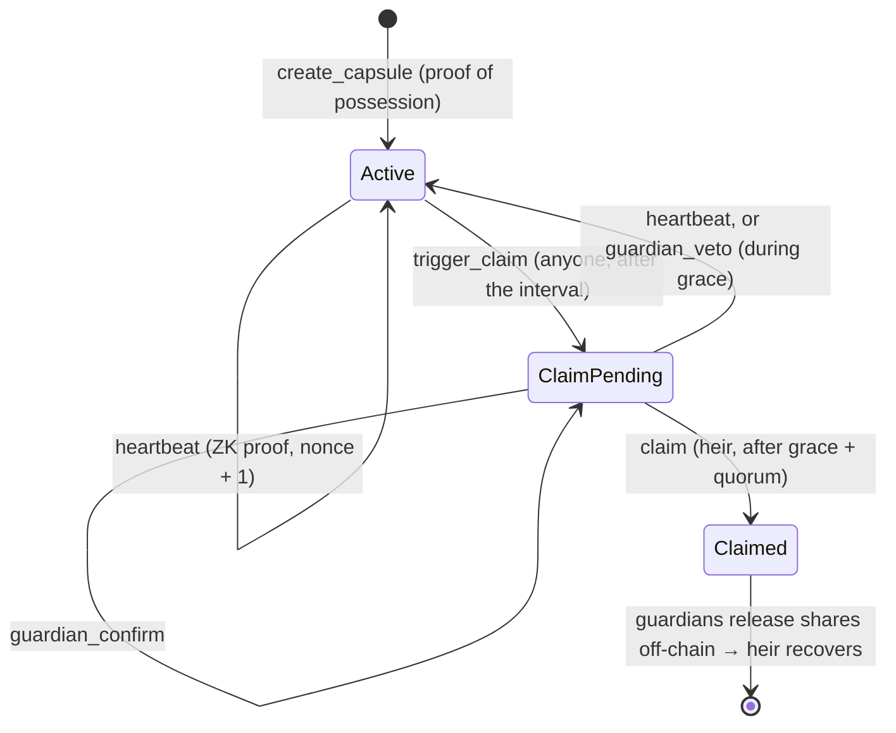

<p align="center">
  
</p>

# SIKRIT

**A dead man's switch on Solana where proving you're alive doesn't reveal who you are.**

Your heir inherits your seed phrase only after you fall silent, and only with your guardians' consent. While you're
alive, your check-ins are zero-knowledge proofs that never touch your wallet.

<p>
  <b>Colosseum Crypto World's Fair 2026</b> · Solana track · University Award · Public Goods Award<br />
  <a href="https://explorer.solana.com/address/FJKqfFBf6Sw87eAfpgDbibiWUKhpmdVjFxexc9BTc45F?cluster=devnet">Program on devnet</a> ·
  <a href="docs/deck/SIKRIT-deck.pdf">Pitch deck (PDF)</a> ·
  Pitch video ⟨link⟩ ·
  Demo video ⟨link⟩ ·
  <a href="docs/SECURITY-REVIEW.md">Security review</a> ·
  <a href="docs/RESEARCH.md">Research &amp; sources</a> ·
  <a href="docs/SUBMISSION.md">Submission kit</a>
</p>

---

## The problem

Self-custody has no next of kin. An estimated **2.3–3.7 million BTC** are already locked forever, partly because
holders died without passing on access. A family must be able to open a wallet when its owner is gone, and must never
be able to while the owner is alive.

Dead man's switches exist. But of the **11 inheritance protocols we reviewed** ([docs/RESEARCH.md](docs/RESEARCH.md)),
every one ties the check-in to the owner's wallet, including one that already uses a zero-knowledge proof. Each
heartbeat publishes *"this address is alive and active, today"*, and silence is public too.

## What SIKRIT does differently

```text
a typical check-in                        a SIKRIT heartbeat
  signer:  7xKp… owner wallet               signer:  relayer (fee payer only)
  vault:   PDA("vault", 7xKp…)              capsule: PDA("capsule", P),  P = x·G
  → "7xKp… is alive, today"                 → "whoever knows x is alive"
```

The owner proves knowledge of a dedicated **liveness key** `x` with a Schnorr zero-knowledge proof. The capsule's
address is derived from `P = x·G`, not from a wallet, and the instruction needs no signer, so any relayer can submit
it. Our end-to-end test plays a full inheritance in Chrome, on a local validator and on Solana devnet, then re-reads
every capsule transaction: **the owner's wallet appears in 0 of 6.** Check one devnet run yourself: capsule
[`5RR3sG…xjX9i`](https://explorer.solana.com/address/5RR3sGRBZwdXAV6SMLFUzzGksMzuigmaLMEMNVCxjX9i?cluster=devnet)
went from creation to a completed claim, and its owner's wallet
[`BvmZmR…TBSW`](https://explorer.solana.com/address/BvmZmRgnuy6y8tWdTbRPdPDC5jsFfhEm3cMsEnkxTBSW?cluster=devnet)
(a demo persona) has never touched the chain at all.

<p align="center"></p>

## How it works

1. **Seal.** The secret is encrypted in the browser (XChaCha20-Poly1305) under a random key. That key is split with
   Shamir's scheme: share 0 for the heir, one share per guardian, each sealed with **HPKE (RFC 9180)** to an inbox
   key that its holder's wallet signed. Only a hash of each share goes on-chain, signed into the capsule by the
   owner's proof-of-possession.
2. **Prove you're alive.** `heartbeat(R, s)` carries a Schnorr proof over the transcript
   `SHA-512("SIKRIT:liveness:v1" ‖ program ‖ capsule ‖ P ‖ R ‖ nonce)`. The program verifies `s·G − e·P = R` with
   Solana's curve25519 syscalls (**41,012 CU**) and bumps the nonce, so every proof works exactly once.
3. **Release on silence.** After a missed interval anyone may open a claim. A heartbeat cancels it; each guardian has
   one veto per heartbeat. After the grace period and a guardian quorum, the heir claims. Only then do guardians
   re-seal their shares to the inbox the on-chain heir certified, and the secret reassembles in the heir's browser.



<table>
  <tr>
    <td width="50%"><br /><sub><b>Owner</b> · one click, proof generated in the browser, sent by a relayer</sub></td>
    <td width="50%"><br /><sub><b>Guardians</b> · confirm the claim, or veto a false alarm</sub></td>
  </tr>
  <tr>
    <td colspan="2" align="center"><br /><sub><b>Heir</b> · her share plus two guardian releases, each authenticated against the chain, rebuild the seed phrase</sub></td>
  </tr>
</table>

## By the numbers

| | |
|---|---|
| Heartbeat verification | **41,012 CU** (curve25519 syscalls; a pure-Rust verifier exceeded 1.4 M CU) |
| `create_capsule` / other instructions | ~69k CU / ~7k CU |
| Cost of a heartbeat | 5,000 lamports. 30 years of weekly heartbeats ≈ **0.0078 SOL**. No token |
| Owner wallets in capsule transactions | **0 of 6**, checked on-chain by the E2E test |
| Tests | 68 TypeScript (LiteSVM lifecycle + SDK + client + relayer) · 10 Rust unit · 12-step browser E2E on localnet and devnet |

## Try it locally (~5 minutes)

Requirements: Rust + Solana CLI 1.18.17 (see [docs/DEVELOPMENT.md](docs/DEVELOPMENT.md)), Node 24, Chrome.

```bash
npm install && npm run build      # Anchor program → target/deploy/sikrit.so
cd app && npm install
npm run localnet                  # solana-test-validator + SIKRIT program + app on http://localhost:5173
npm run e2e                       # optional: the whole inheritance story in headless Chrome (~2.5 min)
```

The demo casts five in-browser wallets (Pak Arif the owner, his daughter Sari, guardians Budi, Dewi and Rizal), and a
relayer pays every fee, so one person can play the whole family in one tab. Real wallets (Phantom, Solflare,
Backpack via Wallet Standard) work for every role. Timers can be as short as one minute, the program's minimum.

The relayer is a small service, [`app/api/relay.ts`](app/api/relay.ts): the dev server runs it locally, and on Vercel
it deploys as a serverless function (set `RELAYER_SECRET_KEY` to a funded devnet keypair). It signs only single SIKRIT
instructions, as fee payer and as a new capsule's rent payer, so its key can't be used to move its SOL anywhere else.

```bash
npm test                # 68 tests: lifecycle on the real SBF binary with a time-travelling clock, SDK vectors, client, relayer
npm run test:rust       # verifier unit tests, incl. a known-answer vector shared with the TypeScript prover
npm run typecheck
```

## Repository

```text
programs/sikrit/src/lib.rs   Anchor program: capsule state machine + Schnorr verifier (curve25519 syscalls)
sdk/liveness.ts              Schnorr prover, byte-for-byte with the on-chain verifier
sdk/hpke.ts                  HPKE RFC 9180 base mode (X25519, HKDF-SHA256, ChaCha20-Poly1305)
sdk/shamir.ts                Shamir over GF(2^8), wrapping an audited library
sdk/kit.ts                   capsule kit: seal, verify against the chain, release, recover
sdk/client.ts                dependency-light program client (no Anchor in the browser)
app/                         demo app: Vite + React + Tailwind + wallet adapter
app/api/relay.ts             relayer service (Vercel function / dev server): pays fees for SIKRIT instructions only
app/e2e/demo-flow.mjs        end-to-end test in Chrome + on-chain privacy check
tests/                       LiteSVM lifecycle tests, SDK tests (RFC 9180 and FIPS-197 vectors, attacks on the kit)
docs/                        pitch, research, technical spec, security review, deck, video scripts, submission kit
```

## Security

SIKRIT is a research prototype and **has not been audited externally**. It ships with a self-audit,
[docs/SECURITY-REVIEW.md](docs/SECURITY-REVIEW.md) (in Indonesian), covering 18 findings across the program, SDK and app, all High/Critical fixed and
tested: proof replay, guardian double-voting, unbounded veto (DoS), an on-chain verifier that could not run (moved to
syscalls), encryption keys without authentication (now wallet-signed inbox certificates), unauthenticated Shamir
reconstruction, and more.

What is public by design, and stated in the pitch:

- **When** heartbeats happen and **who** the heir and guardians are (R1, R3). What stays hidden is **who the owner is**.
- Enough guardians colluding without the heir can open a kit early, a property of any threshold scheme and also the
  heir's recovery path (R15). The create wizard warns about it.
- Guardians releasing only after `Claimed` is enforced by the app and the guardian's honesty, not by cryptography
  (SIK-11). X25519/Ed25519 are not post-quantum (R10).

## Status

- [x] Anchor program, Schnorr verifier, lifecycle tests
- [x] Client SDK (Shamir + HPKE + kit) with test vectors
- [x] Demo app (create → heartbeat → claim → guardian release → recovery), browser E2E
- [x] Static hosting ready (GitHub Pages workflow, `app/vercel.json`)
- [x] Program live on devnet: [`FJKqfFBf6Sw87eAfpgDbibiWUKhpmdVjFxexc9BTc45F`](https://explorer.solana.com/address/FJKqfFBf6Sw87eAfpgDbibiWUKhpmdVjFxexc9BTc45F?cluster=devnet)
  (deployed bytes identical to `anchor build`; the full demo story passes against it with `cd app && npm run e2e:devnet`)
- [ ] Live demo URL ⟨…⟩

Roadmap: watcher alerts when a claim opens, origin-bound key derivation, Ledger support, external audit, then mainnet.
Later: heartbeats inside an anonymity set, hashed heir/guardian commitments, a post-quantum hybrid KEM.

## Team

**Muhammad Ghani Nurramdhan**: 4th-year student in Cryptographic Software Engineering at Politeknik Siber dan Sandi
Negara, Indonesia's state polytechnic for cyber security and cryptography.

## License

[MIT](LICENSE)
