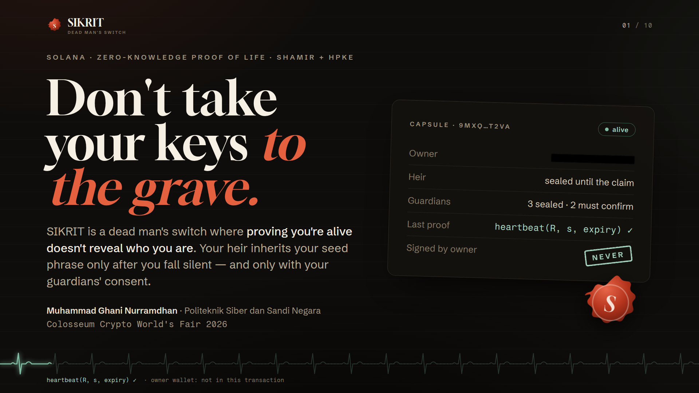
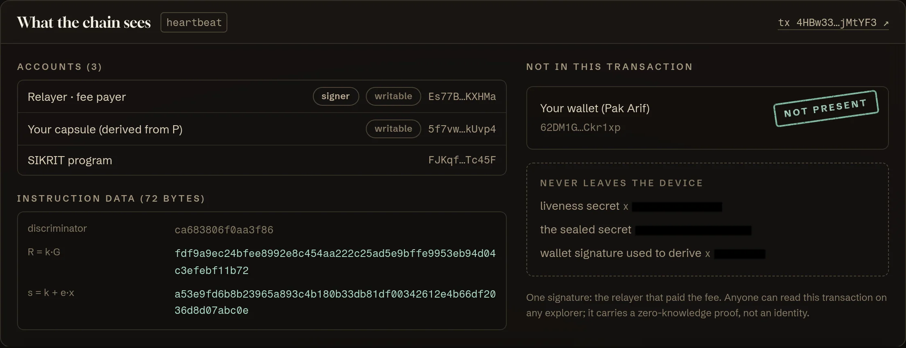
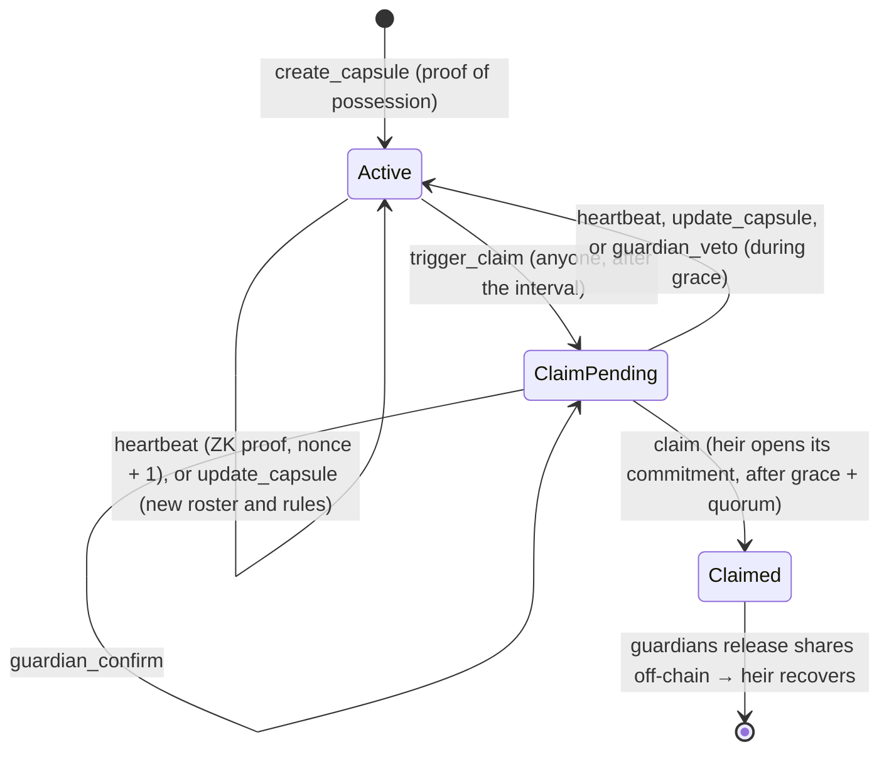
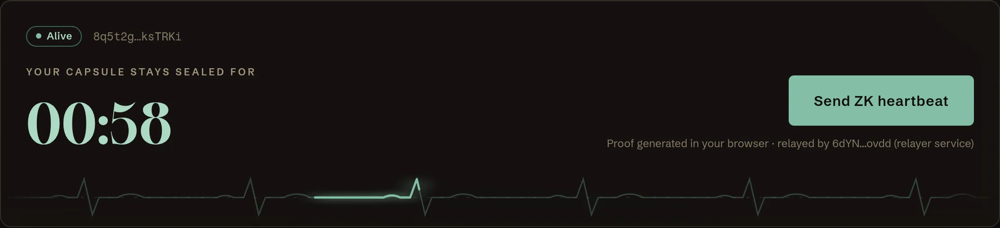
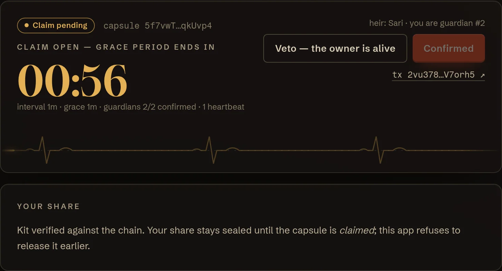
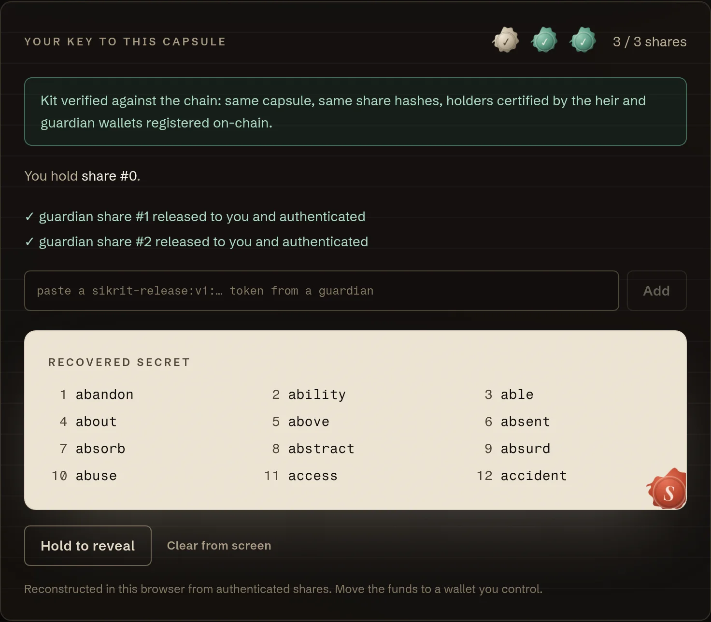

<p align="center">
  
</p>

# SIKRIT

**A dead man's switch on Solana where proving you're alive doesn't reveal who you are.**

Your heir inherits your seed phrase only after you fall silent, and only with your guardians' consent. While you're
alive, your check-ins are zero-knowledge proofs that never touch your wallet, and the chain never learns who your
family is.

<p>
  <b>Colosseum Crypto World's Fair 2026</b> · Solana track · University Award · Public Goods Award<br />
  <a href="https://explorer.solana.com/address/FJKqfFBf6Sw87eAfpgDbibiWUKhpmdVjFxexc9BTc45F?cluster=devnet">Program on devnet</a> ·
  <a href="docs/deck/SIKRIT-deck.pdf">Pitch deck (PDF)</a> ·
  Pitch video ⟨link⟩ ·
  Demo video ⟨link⟩ ·
  <a href="docs/SECURITY-REVIEW.en.md">Security review</a> ·
  <a href="docs/RESEARCH.md">Research &amp; sources</a> ·
  <a href="docs/SUBMISSION.md">Submission kit</a>
</p>

---

## The problem

Self-custody has no next of kin. An estimated **2.3–3.7 million BTC** are already locked forever, partly because
holders died without passing on access. A family must be able to open a wallet when its owner is gone, and must never
be able to while the owner is alive.

Dead man's switches exist. But of the **11 inheritance protocols we reviewed** ([docs/RESEARCH.md](docs/RESEARCH.md)),
every one ties the check-in to the owner's wallet, including one that already uses a zero-knowledge proof. Each
heartbeat publishes *"this address is alive and active, today"*, and silence is public too.

## What SIKRIT does differently

```text
a typical check-in                        a SIKRIT heartbeat
  signer:  7xKp… owner wallet               signer:  relayer (fee payer only)
  vault:   PDA("vault", 7xKp…)              capsule: PDA("capsule", P),  P = x·G
  → "7xKp… is alive, today"                 → "whoever knows x is alive"
```

The owner proves knowledge of a dedicated **liveness key** `x` with a Schnorr zero-knowledge proof. The capsule's
address is derived from `P = x·G`, not from a wallet, and the instruction needs no signer, so any relayer can submit
it. The heir and the guardians are on-chain only as **salted commitments**, so nobody can find the capsule through
the owner's family either: each member shows up only in the transaction where they act. Our end-to-end test plays a
full inheritance in Chrome, on a local validator and on Solana devnet, then re-reads every capsule transaction:
**the owner's wallet appears in 0 of 7**, the heir only in her claim, each confirming guardian only in their own
confirmation, and the guardian the owner removed in none, not even in the update that took them off the roster. Check one devnet
run yourself: capsule
[`GqAtC8…mgqq`](https://explorer.solana.com/address/GqAtC8QKMQ4VSD4ShCfdgQ5AXp9oc1UphVefvRazmgqq?cluster=devnet)
went from creation through a re-seal to a completed claim, and its owner's wallet
[`5623ce…bj45`](https://explorer.solana.com/address/5623ce5pPdXMdB1zCZk9RvWYeN3WatV2h9HDhLRFbj45?cluster=devnet)
(a demo persona) has never touched the chain at all.

<p align="center"></p>

## How it works

1. **Seal.** The secret is encrypted in the browser (XChaCha20-Poly1305) under a random key. That key is split with
   Shamir's scheme: share 0 for the heir, one share per guardian, each sealed with **HPKE (RFC 9180)** to an inbox
   key that its holder's wallet signed. On-chain go only a hash of each share and, per member, a commitment
   `SHA-256("SIKRIT:member:v1" ‖ P ‖ role ‖ wallet ‖ salt)` with a random salt that travels in the kit, all signed
   into the capsule by the owner's proof-of-possession.
2. **Prove you're alive.** `heartbeat(R, s, expiry)` carries a Schnorr proof over the transcript
   `SHA-512("SIKRIT:liveness:v2" ‖ program ‖ capsule ‖ P ‖ R ‖ nonce ‖ expiry)`. The program verifies `s·G − e·P = R`
   with Solana's curve25519 syscalls (**~41k CU**) and bumps the nonce, so every proof works exactly once, and only
   for minutes: a relayer that holds one back cannot use it later.
3. **Release on silence.** After a missed interval anyone may open a claim. A heartbeat cancels it; each guardian has
   one veto per heartbeat. Guardians confirm by opening their commitment with the salt from their kit. After the
   grace period and a guardian quorum, the heir claims the same way. Only then do guardians re-seal their shares to
   the inbox the committed heir certified, and the secret reassembles in the heir's browser.
4. **Change your mind.** Until the claim, the owner can re-seal the secret for a new heir, new guardians, quorum or
   timers. `update_capsule` carries one Schnorr proof over the whole new configuration (`SIKRIT:update:v1`, with the
   same nonce and expiry as a heartbeat), so it needs no wallet either and a relayer can neither alter nor replay it.
   The old commitments and share hashes leave the chain, and guardians refuse to release from the old kit.



<table>
  <tr>
    <td width="50%"><br /><sub><b>Owner</b> · one click, proof generated in the browser, sent by a relayer</sub></td>
    <td width="50%"><br /><sub><b>Guardians</b> · confirm the claim, or veto a false alarm</sub></td>
  </tr>
  <tr>
    <td colspan="2" align="center"><br /><sub><b>Heir</b> · her share plus two guardian releases, each authenticated against the chain, rebuild the seed phrase</sub></td>
  </tr>
</table>

## By the numbers

| | |
|---|---|
| Heartbeat verification | **41,417 CU** on devnet, expiry check included (curve25519 syscalls; a pure-Rust verifier exceeded 1.4 M CU) |
| `create_capsule` / `update_capsule` / the rest | ~66–77k / ~60k / ~6.8–8.3k CU |
| Cost of a heartbeat | 5,000 lamports. 30 years of weekly heartbeats ≈ **0.0078 SOL**. No token |
| Owner wallets in capsule transactions | **0 of 7**, checked on-chain by the E2E test |
| Family wallets on-chain before they act | **0**: heir only in her claim, guardians only in their own confirmation |
| Tests | 79 TypeScript (LiteSVM lifecycle + SDK + client + relayer) · 14 Rust unit · 13-step browser E2E on localnet and devnet |

## Try it locally (~5 minutes)

Requirements: Rust + Solana CLI 1.18.17 (see [docs/DEVELOPMENT.md](docs/DEVELOPMENT.md)), Node 24, Chrome.

```bash
npm install && npm run build      # Anchor program → target/deploy/sikrit.so
cd app && npm install
npm run localnet                  # solana-test-validator + SIKRIT program + app on http://localhost:5173
npm run e2e                       # optional: the whole inheritance story in headless Chrome (~2.5 min)
```

The demo casts five in-browser wallets (Pak Arif the owner, his daughter Sari, guardians Budi, Dewi and Rizal), and a
relayer pays every fee, so one person can play the whole family in one tab. Real wallets (Phantom, Solflare,
Backpack via Wallet Standard) work for every role. Timers can be as short as one minute, the program's minimum.

The relayer is a small service, [`app/api/relay.ts`](app/api/relay.ts): the dev server runs it locally, and on Vercel
it deploys as a serverless function (set `RELAYER_SECRET_KEY` to a funded devnet keypair). It signs only single SIKRIT
instructions, as fee payer and as a new capsule's rent payer, so its key can't be used to move its SOL anywhere else.

```bash
npm test                # 79 tests: lifecycle on the real SBF binary with a time-travelling clock, SDK vectors, client, relayer
npm run test:rust       # verifier unit tests, incl. a known-answer vector shared with the TypeScript prover
npm run typecheck
```

## Repository

```text
programs/sikrit/src/lib.rs   Anchor program: capsule state machine + Schnorr verifier (curve25519 syscalls)
sdk/liveness.ts              Schnorr prover, byte-for-byte with the on-chain verifier
sdk/hpke.ts                  HPKE RFC 9180 base mode (X25519, HKDF-SHA256, ChaCha20-Poly1305)
sdk/shamir.ts                Shamir over GF(2^8), wrapping an audited library
sdk/kit.ts                   capsule kit: seal, verify against the chain, release, recover
sdk/client.ts                dependency-light program client (no Anchor in the browser)
sdk/README.md                integration guide for wallets, relayers and watchers, one capsule end to end
app/                         demo app: Vite + React + Tailwind + wallet adapter
app/api/relay.ts             relayer service (Vercel function / dev server): pays fees for SIKRIT instructions only
app/e2e/demo-flow.mjs        end-to-end test in Chrome + on-chain privacy check
tests/                       LiteSVM lifecycle tests, SDK tests (RFC 9180 and FIPS-197 vectors, attacks on the kit)
docs/                        pitch, research, technical spec, security review, deck, video scripts, submission kit
```

## Security

SIKRIT is a research prototype and **has not been audited externally**. It ships with a self-audit,
[docs/SECURITY-REVIEW.en.md](docs/SECURITY-REVIEW.en.md) (full Indonesian edition:
[docs/SECURITY-REVIEW.md](docs/SECURITY-REVIEW.md)). It covers the program, SDK, app and relayer service, with 22
findings, all High/Critical fixed and tested: proof replay, guardian double-voting, unbounded veto (DoS), an on-chain
verifier that could not run (moved to syscalls), encryption keys without authentication (now wallet-signed inbox
certificates), unauthenticated Shamir reconstruction, a public family roster that led to the owner (now salted
commitments), heartbeat proofs that never expired, a lost confirmation that left a registered capsule without its
kit, and more.

Found something? Please report it privately, as described in [SECURITY.md](SECURITY.md).

What is public by design, and stated in the pitch:

- **When** heartbeats happen (R1), and each family member at the moment they act: a guardian confirming or vetoing,
  the heir claiming (R3). What stays hidden is **who the owner is**, and who stands to inherit before they claim.
- Enough guardians colluding without the heir can open a kit early, a property of any threshold scheme and also the
  heir's recovery path (R15). The create wizard warns about it.
- Guardians releasing only after `Claimed` is enforced by the app and the guardian's honesty, not by cryptography
  (SIK-11). X25519/Ed25519 are not post-quantum (R10).
- Re-sealing revokes roles on-chain, not shares already handed out: enough former holders together could still open
  the old kit (R19). Remove someone you no longer trust, and move the funds too. The update screen says so.

## Status

- [x] Anchor program, Schnorr verifier, lifecycle tests
- [x] Client SDK (Shamir + HPKE + kit) with test vectors
- [x] Demo app (create → heartbeat → claim → guardian release → recovery), browser E2E
- [x] Static hosting ready (GitHub Pages workflow, `app/vercel.json`)
- [x] Protocol v2: sealed heir/guardian roster, heartbeat proofs that expire within the hour
- [x] Protocol v2.1: the owner changes heir, guardians, quorum and timers with one proof (`update_capsule`)
- [x] Program live on devnet, protocol v2.1 since 4 Oct 2026: [`FJKqfFBf6Sw87eAfpgDbibiWUKhpmdVjFxexc9BTc45F`](https://explorer.solana.com/address/FJKqfFBf6Sw87eAfpgDbibiWUKhpmdVjFxexc9BTc45F?cluster=devnet)
  (deployed bytes identical to `anchor build`; the full demo story passes against it with `cd app && npm run e2e:devnet`)
- [ ] Live demo URL ⟨…⟩

Roadmap: watcher alerts when a claim opens, origin-bound key derivation, Ledger support, external audit, then mainnet.
Later: heartbeats inside an anonymity set, a "blind" kit that hides the roster from a leaked file, a post-quantum
hybrid KEM.

## Team

**Muhammad Ghani Nurramdhan**: 4th-year student in Cryptographic Software Engineering at Politeknik Siber dan Sandi
Negara, Indonesia's state polytechnic for cyber security and cryptography.

## License

[MIT](LICENSE)
