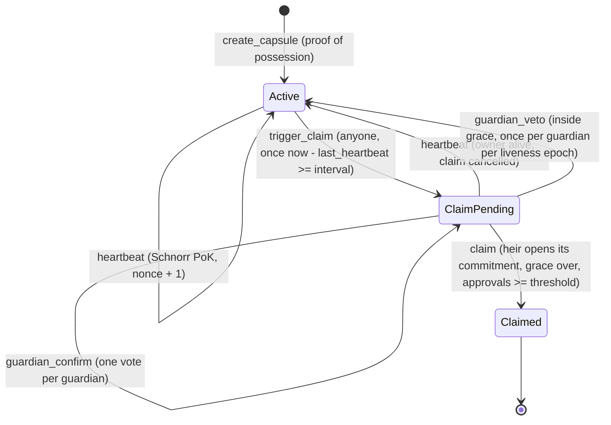

# SIKRIT — Security Review (English edition)

> English edition of the self-audit in [`SECURITY-REVIEW.md`](SECURITY-REVIEW.md) (Indonesian), which keeps the longer
> write-ups and original line references. **This is a self-audit, not an external audit.**
>
> **Scope:** the Anchor program (`programs/sikrit`), the client SDK (`sdk/`: Schnorr prover, HPKE, Shamir, capsule
> kit, program client), the demo app (`app/`) and its relayer service (`app/api/relay.ts`).
> **Dates:** 30 Sep – 1 Oct 2026. **Method:** manual review (cryptography and smart-contract security), real SBF
> builds, 73 TypeScript tests (the lifecycle and relayer tests run the real SBF binary in LiteSVM with a
> time-travelling clock), 12 Rust unit tests, a 12-step browser end-to-end run on a local validator and on devnet, and
> compute-unit benchmarks.
>
> **Result:** 20 findings: 3 Critical, 4 High, 5 Medium, 7 Low, 1 Info (design). 19 are fixed in code and covered by
> tests; SIK-11 is mitigated in the client. What remains is listed openly as residual risks R1–R18. SIK-19 and SIK-20
> led to protocol v2 (§2): a sealed roster and short-lived heartbeat proofs.

## 1. Findings

| ID | Severity | Finding | Fix | Status |
|---|---|---|---|---|
| SIK-01 | 🔴 Critical | Heartbeat proofs could be **replayed** forever: the Fiat–Shamir challenge hashed only `R ‖ P`, so anyone could keep a dead owner "alive" and block the inheritance | Challenge binds domain, program, capsule and a monotonic nonce (§2) | ✅ Fixed |
| SIK-02 | 🔴 Critical | **Guardian double-voting**: approvals were a counter, so one guardian (or one leaked guardian key) could satisfy an N-of-M threshold alone | Per-guardian bitmap; a second vote fails with `GuardianAlreadyApproved` | ✅ Fixed |
| SIK-03 | 🔴 Critical (blocker) | The on-chain Schnorr verifier **could not run**: compile error, SBF stack overflow, and a pure-Rust (curve25519-dalek) variant exceeded 1.4M CU | Point operations through Solana's curve25519 syscalls; one multiscalar multiplication per proof | ✅ Fixed |
| SIK-04 | 🟠 High | The privacy claim collapsed: the capsule PDA was derived from the owner's wallet and `owner` was stored in plaintext | PDA from a dedicated liveness key `P`; no owner field; heartbeat needs no signer | ✅ Fixed |
| SIK-05 | 🟠 High | A living owner could not cancel a **false trigger** (heartbeats were refused once a claim was open) | A valid heartbeat cancels a pending claim until the heir actually claims | ✅ Fixed |
| SIK-06 | 🟠 High | **Unbounded vetoes** → permanent denial of service against the heir | Vetoes only inside the grace period, one per guardian per liveness epoch; worst-case delay bounded | ✅ Fixed |
| SIK-07 | 🟡 Medium | Commitment `P` not validated (small-order/mixed-torsion points allow forged proofs) and no proof-of-possession (front-running, registering someone else's key) | `P` must be canonical, not the identity, in the prime-order subgroup; `create_capsule` requires a Schnorr proof over the whole config | ✅ Fixed |
| SIK-08 | 🟡 Medium | Guardian set not validated: duplicates, the heir as guardian, the default pubkey | `CapsuleConfig::validate()` with specific errors | ✅ Fixed |
| SIK-09 | 🔵 Low | Hand-computed account `space` | `#[derive(InitSpace)]` | ✅ Fixed |
| SIK-10 | 🔵 Low | Broken build/test configuration (no workspace, no `idl-build`, recursive test script, placeholder program ID) | Pinned workspace + lockfile, real program ID, `npm test` | ✅ Fixed |
| SIK-11 | ⚪ Info (design) | `claim` only flips a status; releasing the secret is not enforced cryptographically | Client custody protocol (§3): the heir holds one share (< k), guardians release only after `Claimed`, only to the heir's certified inbox | 🟡 Mitigated |
| SIK-12 | 🟠 High (design) | Encryption keys of heirs/guardians were **unauthenticated**: whoever swapped a key in transit received the share, at sealing or at release | Wallet-signed *inbox certificates*, checked against the on-chain heir and guardians | ✅ Fixed |
| SIK-13 | 🟡 Medium | Shamir `combine` silently returned a wrong secret for forged or missing shares | Each share is authenticated against its on-chain hash; distinct-share count checked; the payload's AEAD tag fails closed | ✅ Fixed |
| SIK-14 | 🔵 Low | The seed phrase was split directly (non-uniform secret; share length leaked secret length) | Hybrid: split a random 32-byte key, encrypt the secret with XChaCha20-Poly1305 | ✅ Fixed |
| SIK-15 | 🔵 Low | Keys derived from wallet signatures assumed deterministic signatures (some MPC wallets randomize) | Sign twice, verify both, refuse if they differ | ✅ Fixed |
| SIK-16 | 🟡 Medium | App: a guardian's release state **leaked between personas/accounts**: the second guardian saw "released" while their share was never sent | Components keyed per actor; release state stored per (capsule, guardian wallet) | ✅ Fixed |
| SIK-17 | 🔵 Low | App could be framed on hosts without security headers → clickjacking of the key-derivation signature prompt | `frame-ancestors 'none'`, `X-Frame-Options: DENY`, frame-busting, `no-referrer` | ✅ Fixed |
| SIK-18 | 🔵 Low | Guardian discovery (5 × `getProgramAccounts` per poll) drew HTTP 429s from the public devnet RPC → guardians never saw their capsule and the release path stalled | One `getProgramAccounts` over a `dataSlice` of the guardian vector + one `getMultipleAccounts` (since v2: no chain search at all, members find capsules through their kit) | ✅ Fixed |
| SIK-19 | 🟡 Medium | The heir and guardians were stored as plaintext wallets: anyone who knows one family member's wallet could find the owner's capsule and watch its heartbeats | Protocol v2: salted member commitments, opened only by the member's own confirm, veto or claim (§2) | ✅ Fixed |
| SIK-20 | 🔵 Low | Heartbeat proofs never expired: a relayer that held one back could revive a silent owner once, or cancel a claim | Protocol v2: the proof binds an expiry at most one hour ahead of the cluster clock (§2) | ✅ Fixed |

Selected details (the Indonesian edition has all of them):

- **SIK-01.** Every `(R, s)` is public in a transaction. With `e = H(R ‖ P)` a proof stays valid forever, so anyone could
  re-submit an old proof each interval and the heir could never claim. Tests: *rejects a replayed proof, so nobody can
  keep a dead owner 'alive'*, *rejects proofs bound to a stale or future nonce*, and the Rust test
  `proof_is_bound_to_nonce_capsule_domain_and_program`.
- **SIK-03.** Measured, not assumed: with curve25519-dalek on SBF, `create_capsule` ran out of the 1.4M CU budget
  (`exceeded CUs meter` after 1,399,850 CU) and `heartbeat` hit `Access violation in stack frame 7`. The syscalls
  (`sol_curve_validate_point`, `sol_curve_group_op`, `sol_curve_multiscalar_mul`) verify a heartbeat in about 41k CU.
  dalek remains for scalar arithmetic and as the host backend for unit tests; its oversized lookup tables are absent
  from the final binary (0 `NafLookupTable` symbols in `sikrit.so`).
- **SIK-05/06.** The owner can always answer a claim with a heartbeat until the heir claims. A guardian veto is only
  possible inside the grace period, gives the owner a full new interval, and is limited to one per guardian until the
  owner's next heartbeat, so malicious guardians can delay an inheritance by at most
  `guardians × (interval + grace)`.
- **SIK-07.** Ed25519 has cofactor 8. With a small-order `P`, proofs can be forged without the secret with probability
  ≥ 1/8 per attempt. The program now requires `ℓ·P = O`, computed as `(ℓ − 1)·P + P` because the syscall only takes
  canonical scalars. The registration proof signs the Borsh-encoded config, so it cannot be moved to another heir.
- **SIK-12.** An X25519 inbox key is not a wallet key, so it travels off-chain. An inbox certificate is the holder's
  wallet signature over `"SIKRIT inbox certificate v1: <hex inbox>"`; sealing, kit verification and release all check
  it against the heir and guardians committed on-chain.
- **SIK-19.** The owner never appeared on-chain, but the family did. Someone targeting a wealthy person usually knows,
  or can find through chain analysis, the wallet of a child or of the family notary. One `getProgramAccounts` filtered
  on the `heir` field (our own SDK offered it) found the owner's capsule, and from then on every heartbeat: when they
  were last alive, and how long they have been silent. That is exactly what SIKRIT exists to hide, leaking through the
  people closest to them. Since v2 the chain stores only salted commitments; a member's wallet appears only in the
  transaction where they act, and the end-to-end test checks this on devnet: the heir only in her claim, each
  confirming guardian only in their own confirmation, and the guardian who never acts nowhere at all.
- **SIK-20.** A proof was bound to the nonce, so it could not be replayed once used, but a proof that never reached the
  chain stayed valid forever. A relayer that withheld the owner's last heartbeat (and reported a failure) could submit
  it after the owner's death, delaying the inheritance by up to an interval plus grace. Now the expiry is part of the
  challenge and the program accepts it only while `now ≤ expires_at ≤ now + 3600`; the app gives proofs 10 minutes.

## 2. The protocol after the fixes (v2)

```
e = SHA-512(domain ‖ program_id ‖ capsule ‖ P ‖ R ‖ context) mod ℓ          (wide reduction of 64 bytes)
Prover:    k = hedged nonce (x, fresh randomness, transcript),  R = k·G,  s = k + e·x mod ℓ
Verifier:  s canonical (< ℓ), R a valid point, and  s·G − e·P == R  (compared as canonical encodings)

Registration:  domain = "SIKRIT:register:v2",  context = Borsh(CapsuleConfig)
Liveness:      domain = "SIKRIT:liveness:v2",  context = heartbeat_nonce (u64 LE) ‖ expires_at (i64 LE),
               accepted only while now ≤ expires_at ≤ now + 3600 (Clock sysvar)

Members:       c = SHA-256("SIKRIT:member:v1" ‖ P ‖ role ‖ wallet ‖ salt),  role 0 = heir, 1 = guardian,
               salt = 32 random bytes per member, carried in the kit; opened by guardian_confirm/veto(slot, salt)
               and claim(salt) with wallet = the signer
```

Both Schnorr domains have the same length (18 bytes) and differ in content, so transcripts cannot be confused; every
field of a member commitment has a fixed length. The Schnorr format is pinned across languages by one known-answer
vector shared by the TypeScript prover tests and the Rust verifier tests; member commitments have their own vector,
recomputed with Python `hashlib`. The 256-bit salt makes a commitment hiding against a guess over every Solana wallet,
SHA-256 makes it binding to one wallet, and P plus a per-capsule salt keep the same person unlinkable across capsules.



Compute units, real SBF binary (LiteSVM, max observed, v2): `create_capsule` ~66–74k (varies with the PDA bump
search), `heartbeat` 41,447 (including the expiry check), `trigger_claim` / `guardian_veto` ~7.6k,
`guardian_confirm` / `claim` ~8–8.3k (including the SHA-256 opening). All fit the default 200k budget.

## 3. Share custody in the client (SDK)

```
dek ← random 32 B;  payload = XChaCha20-Poly1305(dek, nonce, aad = "SIKRIT:payload:v1" ‖ P ‖ k ‖ n)(secret)
share_i = Shamir k-of-n(dek)             sealed_i = HPKE base mode (X25519, HKDF-SHA256, ChaCha20-Poly1305)
hash_i  = SHA-256("SIKRIT:share-hash:v1" ‖ P ‖ share_i)   → stored on-chain, signed by the proof of possession
salt_i  ← random 32 B per holder (kit v2)                 → member commitment on-chain (§2)
share_0 → heir,  share_{1+g} → guardian g,  k − 1 = guardian quorum
```

A guardian releases only after `Claimed`, and only to an inbox certified by the heir wallet the on-chain commitment
binds (wallet + salt from the kit), never to whichever heir an RPC reports.

Known-answer vectors: HPKE against RFC 9180 Appendix A.2.1 (key schedule, six encryptions with sequence numbers
0–256, exported values); GF(2⁸) Shamir against a table-free reference anchored to FIPS-197 §4.2 (`{57}·{83} = {c1}`);
inbox keys and share hashes recomputed independently with Python `hashlib`/`hmac` and pyca `cryptography`.

## 4. Relayer service (`app/api/relay.ts`)

The hosted devnet demo cannot depend on the public faucet, so a relayer service pays fees and new capsules' rent. It is
also the "relayer" of the privacy story: the owner's heartbeats reach the chain with the service as the only fee payer.
Threat model: anyone on the internet can POST transactions to it.

| Control | Prevents | Test |
|---|---|---|
| Signs only legacy transactions with itself as fee payer and **exactly one** SIKRIT instruction with a known discriminator (the same as the SDK's) | Use as a general-purpose fee payer; a second instruction riding along | *refuses every transaction…*, *knows the same instructions as the SDK…* |
| Its key may appear in the instruction only as `create_capsule`'s rent payer | Its signature authorizing anything else: a System transfer out of the relayer, the relayer acting as a guardian | *refuses every transaction…* |
| Every other signature verified before sending; preflight on | Burning fees with transactions bound to fail | *refuses…*, *hands program errors back with their logs…* |
| Per client: 10 transactions/minute, 6 new capsules/hour | Draining rent by spamming `create_capsule` from one address | *rate-limits each client…* |
| Key only in a server environment variable, never `VITE_`-prefixed; the production bundle checked free of relay code | Key leaking through the browser bundle | bundle inspection |

No findings in the released code. The tests drive the service against the real program in LiteSVM, including a whole
relayed inheritance in which the heir and the guardian hold no SOL at all.

## 5. Residual risks and limits

| # | Risk | Notes and mitigation |
|---|---|---|
| R1 | Heartbeat **times** are public | Anyone who knows a capsule's address sees when it was last proven alive. SIKRIT hides **who**, not **when**. Roadmap: anonymous membership proofs so a heartbeat does not point at one capsule. |
| R2 | Linking through the fee payer | If the owner's own wallet paid for a heartbeat, that transaction would link wallet and capsule. The app always uses a relayer. |
| R3 | The roster is sealed, not invisible | Since v2 (SIK-19) only salted commitments are stored; a member's wallet appears when they act (a guardian's confirm or veto, the heir's claim). Still public: the number of guardians, the quorum and the timers. The kit file names the whole family (wallets + salts), so it goes to the holders only; a leaked kit reveals the roster, not the secret. Roadmap: a "blind" kit that keeps each identity inside its holder's HPKE envelope. |
| R4 | Upgrade authority | On devnet a single hot key (`FNNYNGG…Vd5N`) can upgrade the program; a malicious upgrade could relax the timers so the heir claims early. Mainnet: Squads multisig with a timelock, a verifiable build, then immutable after an external audit. |
| R5 | Delay by malicious guardians | Bounded by `guardians × (interval + grace)`. |
| R6 | Legacy toolchain | Anchor 0.30 emits SBPF v0. A pending feature gate (SIMD-0500, inactive on devnet and mainnet as of 30 Sep 2026; our devnet deploy on 1 Oct succeeded) would block new deploys of such binaries, not their execution. Plan: Anchor 1.x after the hackathon. |
| R7 | Rent is not reclaimable | No `close` instruction; ~0.004–0.005 SOL per capsule stays locked. |
| R8 | Owner unaware of a trigger | Needs an off-chain watcher that alerts the owner during the grace period (roadmap). |
| R9 | Phishing of the key-derivation signature | A site that obtains the same signature could fake heartbeats (delay the inheritance) but cannot open the secret. Mitigation: bind the app origin into the message (Sign-In-With-Solana style). |
| R10 | Not post-quantum | X25519 and Ed25519. Kits are not stored on public permanent storage (only hashes on-chain), limiting harvest-now-decrypt-later. Roadmap: X-Wing hybrid KEM; the kit format is versioned. |
| R11 | JavaScript side channels | JS gives no constant-time guarantees; the Shamir library uses table lookups. Operations run once, on the user's device. |
| R12 | Wallet compatibility | Requires `signMessage` with deterministic Ed25519 over raw bytes; randomizing MPC wallets are refused at setup; Ledger needs separate support. |
| R13 | Heir loses their wallet | Their share cannot be opened again; recovery runs through enough guardians releasing to a new inbox the on-chain heir wallet certifies. |
| R14 | Transitive npm advisories | `uuid` chains through `@solana/web3.js` and `toml` in the test tooling; the vulnerable code paths are not reached (analysis in the Indonesian edition). Monitored. |
| R15 | Guardian collusion without the heir | With k = quorum + 1 and at least k guardians, k colluding guardians can open the kit without the heir. Inherent to threshold schemes and also the heir's recovery path (R13). The create wizard warns whenever this path exists; quorum = all guardians removes it. |
| R16 | Demo keys in `localStorage` | Demo personas and the in-browser relayer keep hot keys in the browser; devnet/localnet only, labelled as demo, protected by a strict CSP. Real wallets never store keys in the app. |
| R17 | Guardians trust their RPC | A malicious RPC could report `Claimed` early; the share still opens only for the heir's certified inbox, so this needs heir + RPC collusion. Since v2 the release target is bound to the committed heir, so an RPC that names another heir is refused. Mitigation: check the `claim` transaction on an explorer; roadmap: cross-check two RPCs. |
| R18 | The relayer is an observation and payment point | Its operator sees the IP and timing of each heartbeat and which capsule it is for (the same exposure an RPC node gets, concentrated in one operator): run your own relayer, use Tor/VPN. An attacker with many IPs can drain the devnet relayer's rent budget (demo downtime, no user funds at risk). Off Vercel, `x-forwarded-for` can be spoofed to dodge per-client limits. |

## 6. Claims we make, and claims we don't

- ✅ A SIKRIT heartbeat is a zero-knowledge proof of knowledge (Schnorr, Fiat–Shamir) from a dedicated liveness key.
  No wallet or owner identity appears in the state, the events or the heartbeat instruction, and anyone can relay it.
  On devnet, a full inheritance ran with the owner's wallet in 0 of 6 capsule transactions; that wallet has never
  touched the chain.
- ✅ While the owner is alive, the chain stores no wallet of their family either: the heir and guardians are salted
  commitments, each opened only when that member acts.
- ❌ We do **not** claim that heartbeat times are hidden (R1), nor that guardians and heirs cannot see that the owner is
  alive: anyone who knows the capsule address can read `last_heartbeat`.
- A Schnorr NIZK is close to a Schnorr signature by a single-purpose key. Its strength here is **unlinkability +
  replay protection + domain separation**, not SNARK machinery.

## 7. Reproduce

```bash
npm run build                 # anchor build: SBF + IDL (Solana 1.18.17, Anchor CLI 0.30.2)
npm run test:rust             # 12 Rust unit tests: Schnorr verifier, member commitments, config, cross-language vectors
npm test                      # 73 tests on Node 24: LiteSVM lifecycle, SDK vectors and attacks, client, relayer
cd app && npm run e2e         # the whole story in Chrome on a local validator + on-chain privacy check
npm run e2e:devnet            # the same through the production bundle and the relayer service, on devnet
```

Toolchain details: [`DEVELOPMENT.md`](DEVELOPMENT.md) (Indonesian).
