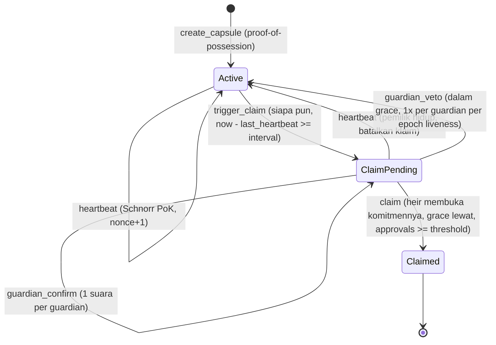

# SIKRIT — Security & Code Review (`programs/sikrit`)

> **Scope:** `programs/sikrit/src/lib.rs` versi awal (draft v0.1), konfigurasi build (`Anchor.toml`, `Cargo.toml`), desain kriptografi Schnorr proof-of-liveness, dan (sejak 30 Sep malam) protokol custody share di SDK client (`sdk/hpke.ts`, `sdk/shamir.ts`, `sdk/kit.ts`) — lihat §5; frontend (§6), relayer service `app/api/relay.ts` (§7), protokol v2 (§9) dan re-audit independen kode v2 (§10).
> **Tanggal:** 30 September – 3 Oktober 2026 · **Metode:** review manual (kriptografi + keamanan smart contract), kompilasi SBF nyata, 12 unit test Rust, 73 test TypeScript (lifecycle di LiteSVM dengan time-travel, SDK, client, relayer), E2E Chrome melawan validator lokal dan devnet, dan benchmark compute unit.
> **Hasil:** 22 temuan — 3 Critical, 4 High, 6 Medium, 8 Low, 1 Info (desain). Dua puluh satu sudah diperbaiki di kode; SIK-11 dimitigasi di client (urutan release tetap janji guardian, bukan paksaan kriptografis). SIK-16/17 berasal dari audit akhir frontend, SIK-18 dari E2E pertama melawan devnet (§6), SIK-19/20 dari review protokol setelah deploy (§9), SIK-21/22 dari re-audit kode v2 (§10).

---

## 1. Ringkasan Temuan

| ID | Severity | Temuan | Status |
|---|---|---|---|
| SIK-01 | 🔴 Critical | Replay bukti heartbeat: challenge Fiat–Shamir tanpa freshness/konteks | ✅ Fixed |
| SIK-02 | 🔴 Critical | Double-voting guardian: persetujuan dihitung tanpa identitas guardian | ✅ Fixed |
| SIK-03 | 🔴 Critical (blocker) | Verifikasi Schnorr tidak bisa berjalan on-chain (compile error, stack overflow SBF, > batas 1,4 jt CU) | ✅ Fixed |
| SIK-04 | 🟠 High | Klaim privasi runtuh: PDA diturunkan dari wallet pemilik & `owner` disimpan plaintext | ✅ Fixed |
| SIK-05 | 🟠 High | Pemilik yang masih hidup tidak bisa membatalkan false-trigger | ✅ Fixed |
| SIK-06 | 🟠 High | Veto tanpa batas (kapan saja, berulang) → DoS permanen terhadap ahli waris | ✅ Fixed |
| SIK-07 | 🟡 Medium | Commitment tidak divalidasi (titik small-order) & tanpa proof-of-possession | ✅ Fixed |
| SIK-08 | 🟡 Medium | Validasi guardian: duplikat, ahli waris sebagai guardian, pubkey default | ✅ Fixed |
| SIK-09 | 🔵 Low | Kalkulasi `space` manual (rawan salah saat struct berubah) | ✅ Fixed |
| SIK-10 | 🔵 Low | Konfigurasi build/test rusak (workspace, `idl-build`, script test rekursif, program ID placeholder) | ✅ Fixed |
| SIK-11 | ⚪ Info (desain) | `claim` hanya flag status — pelepasan rahasia belum dipaksakan secara kriptografis | 🟡 Mitigated (client, §5) |
| SIK-12 | 🟠 High (desain) | Kunci enkripsi ahli waris/guardian tanpa autentikasi → share bisa disegel/di-release ke kunci penyerang | ✅ Fixed (§5) |
| SIK-13 | 🟡 Medium | Shamir `combine` diam-diam menghasilkan rahasia salah untuk share palsu/kurang | ✅ Fixed (§5) |
| SIK-14 | 🔵 Low | Seed phrase di-split langsung (secret tidak uniform, panjang share membocorkan panjang rahasia) | ✅ Fixed (§5) |
| SIK-15 | 🔵 Low | Derivasi kunci dari tanda tangan wallet mengasumsikan tanda tangan deterministik tanpa dicek | ✅ Fixed (§5) |
| SIK-16 | 🟡 Medium | Frontend: state release guardian bocor antar persona/akun → guardian kedua melihat "released" palsu dan share-nya tak pernah dikirim | ✅ Fixed (§6) |
| SIK-17 | 🔵 Low | Frontend: app bisa di-frame di host tanpa header keamanan → clickjacking prompt tanda tangan derivasi kunci | ✅ Fixed (§6) |
| SIK-18 | 🔵 Low | Discovery guardian (5 × `getProgramAccounts` per polling) ter-rate-limit RPC publik → guardian tak melihat kapsulnya, jalur release macet | ✅ Fixed (§6) |
| SIK-19 | 🟡 Medium | Heir & guardian plaintext on-chain: siapa pun yang tahu wallet seorang anggota keluarga bisa menemukan kapsul pemilik dan memantau heartbeat-nya | ✅ Fixed (§9, protokol v2) |
| SIK-20 | 🔵 Low | Bukti heartbeat tanpa masa berlaku: relayer yang menahan bukti bisa "menghidupkan" pemilik yang sudah diam sekali lagi | ✅ Fixed (§9, protokol v2) |
| SIK-21 | 🔵 Low | Relayer service membayar tanda tangan tambahan: heartbeat yang ditempeli signer sekali pakai membuatnya membayar fee hingga 9× | ✅ Fixed (§10) |
| SIK-22 | 🟡 Medium | Konfirmasi registrasi yang hilang membuang kit: kapsul terdaftar tanpa kit, dan wallet pemilik tidak bisa mendaftar lagi | ✅ Fixed (§10) |

Nomor baris di bawah merujuk ke **draft awal** `lib.rs`.

---

## 2. Detail Temuan

### SIK-01 🔴 Replay bukti heartbeat (CWE-294: Authentication Bypass by Capture-replay)

**Lokasi:** `lib.rs:86-91` — `e = SHA512(R ‖ Commitment)`
**Masalah:** challenge hanya bergantung pada `R` dan `P`. Setiap `(R, s)` yang pernah dikirim tercatat publik di transaksi, dan tetap valid selamanya. Siapa pun (misalnya pihak yang ingin menggagalkan pewarisan) bisa me-replay bukti lama tiap interval agar pemilik yang sudah wafat tampak "hidup" terus → ahli waris **tidak pernah** bisa klaim. Tidak ada juga domain separation: bukti yang sama valid untuk kapsul lain dengan `P` sama atau deployment program lain.
**Perbaikan:** transkrip diikat ke konteks dan counter monoton:

```
e = SHA-512(domain ‖ program_id ‖ capsule ‖ P ‖ R ‖ context) mod ℓ
domain  = "SIKRIT:liveness:v1"            context = heartbeat_nonce (u64 LE)
```

`heartbeat_nonce` naik setiap heartbeat sukses → setiap bukti hanya berlaku sekali. (Protokol v2 menambahkan `expires_at` ke context dan menaikkan domain ke `v2`, lihat SIK-20.)
**Test:** `rejects a replayed proof, so nobody can keep a dead owner 'alive'`, `rejects proofs bound to a stale or future nonce`, `proof_is_bound_to_nonce_expiry_capsule_domain_and_program` (Rust).

### SIK-02 🔴 Double-voting guardian (CWE-837: Improper Enforcement of a Single, Unique Action)

**Lokasi:** `lib.rs:140` — `guardian_approvals.saturating_add(1)`
**Masalah:** tidak dicatat guardian mana yang sudah menyetujui. Satu guardian (atau satu kunci guardian yang bocor) cukup memanggil `guardian_confirm` sebanyak `threshold` kali → skema N-of-M runtuh menjadi 1-of-M. Kolusi satu guardian + ahli waris = pelepasan dini.
**Perbaikan:** bitmap `approvals: u8` (bit ke-i = guardian di slot i; sejak v2 slot dibuka dengan komitmennya, SIK-19), suara ganda ditolak dengan `GuardianAlreadyApproved`.
**Test:** `counts each guardian once, so one guardian cannot satisfy a 2-of-3 threshold alone`.

### SIK-03 🔴 Verifikasi Schnorr tidak bisa berjalan on-chain (blocker)

**Lokasi:** `lib.rs:2,94-96`, `Cargo.toml` (`curve25519-dalek` dengan `default-features = false`)
**Masalah (terverifikasi dengan compiler & runtime, bukan asumsi):**
1. **Tidak compile:** `error[E0432]: unresolved import curve25519_dalek::constants::ED25519_BASEPOINT_TABLE` — konstanta itu butuh feature `precomputed-tables` (dimatikan oleh `default-features = false`), dan di dalek 4.x tipenya `&'static`, jadi `&ED25519_BASEPOINT_TABLE * &s` pun tidak valid.
2. **Melampaui batas stack SBF:** platform-tools melaporkan `Stack offset of 10984 exceeded max offset of 4096` pada tabel lookup dalek.
3. **Benchmark varian software-murni** (kode yang sama, backend kurva diganti curve25519-dalek di SBF, budget maksimum 1,4 jt CU):

| Instruksi | Syscall (produksi) | curve25519-dalek murni |
|---|---|---|
| `create_capsule` | 54.450 CU | ❌ `exceeded CUs meter` setelah 1.399.850 CU |
| `heartbeat` | 38.426 CU | ❌ `Access violation in stack frame 7` setelah 322.056 CU |

**Perbaikan:** operasi grup memakai syscall native Solana `sol_curve_validate_point`, `sol_curve_group_op`, `sol_curve_multiscalar_mul` (aktif di devnet sejak slot 240.192.004 dan mainnet sejak slot 275.184.000). Verifikasi `s·G − e·P == R` hanya **satu** panggilan multiscalar-mul. curve25519-dalek tetap dipakai untuk aritmetika skalar (reduksi `mod ℓ`, cek kanonik) dan sebagai backend host untuk unit test. Fungsi dalek yang melanggar batas stack **tidak ada** di binary final (0 simbol `NafLookupTable` di `sikrit.so`, diverifikasi dengan `llvm-objdump`); pesan `Stack offset exceeded` yang masih muncul saat build berasal dari kode dalek yang dieliminasi LTO.
**Test:** seluruh suite TS menjalankan verifier via syscall di binary SBF asli.

### SIK-04 🟠 Klaim privasi runtuh (CWE-359: Exposure of Private Personal Information)

**Lokasi:** `lib.rs:208` (`seeds = [b"capsule", owner]`), `lib.rs:37,270` (field `owner`), `lib.rs:299` (event `CapsuleCreated.owner`), `lib.rs:227` (`caller: Signer`)
**Masalah:** diferensiator utama SIKRIT ("heartbeat tidak membocorkan identitas") tidak terpenuhi. Siapa pun bisa menurunkan alamat kapsul dari pubkey wallet mana pun, lalu membaca `last_heartbeat` — persis ancaman "stalker" di threat model spec. Juri keamanan akan melihat ini dalam hitungan detik.
**Perbaikan:**
- PDA = `["capsule", P]` dengan `P` kunci publik liveness khusus (bukan kunci wallet); field `owner` dihapus; event tidak memuat wallet.
- `heartbeat` & `trigger_claim` **tanpa signer**: bukti Schnorr adalah satu-satunya otorisasi, jadi transaksi bisa di-relay fee payer mana pun.
- `create_capsule` dibayar `payer` generik yang tidak disimpan.
- SDK: `deriveLivenessSecret()` menurunkan `x` dari tanda tangan wallet atas pesan tetap → pemilik bisa memulihkan `x` dan menemukan kapsulnya tanpa menyimpan apa pun.

**Test:** `creates a capsule addressed only by its liveness commitment (no wallet identity on-chain)` memeriksa byte akun & event tidak memuat wallet pembayar; `accepts a proof relayed by an unrelated fee payer` memeriksa instruksi hanya berisi akun kapsul (tanpa signer).

### SIK-05 🟠 False-trigger tidak bisa dibatalkan pemilik (CWE-841: Improper Enforcement of Behavioral Workflow)

**Lokasi:** `lib.rs:70` — heartbeat mensyaratkan `status == Active`
**Masalah:** `trigger_claim` permissionless. Begitu pemilik telat satu interval (sakit, di pesawat, lupa), siapa pun men-trigger, dan pemilik **tidak bisa lagi** membuktikan liveness. Untuk kapsul tanpa guardian (threshold 0), ahli waris pasti bisa klaim walau pemilik masih hidup. Grace period di spec ("perlindungan false-trigger") tidak berfungsi untuk pemilik.
**Perbaikan:** heartbeat valid diterima saat `Active` **atau** `ClaimPending` (sampai ahli waris benar-benar klaim); status kembali `Active`, approval direset, event memuat `claim_cancelled = true`.
**Test:** `a heartbeat cancels a pending claim — even after the grace period, until the heir claims`.

### SIK-06 🟠 Veto tanpa batas → DoS permanen (CWE-400 / desain)

**Lokasi:** `lib.rs:152-169`
**Masalah:** (a) veto boleh kapan saja selama `ClaimPending`, termasuk **setelah** grace period (spec: "dalam grace period"), sehingga guardian bisa front-run klaim ahli waris; (b) satu guardian bisa memveto setiap siklus selamanya; (c) setelah veto, `last_heartbeat` tetap lama sehingga `trigger_claim` bisa langsung dipanggil lagi — veto tidak memberi pemilik waktu sama sekali.
**Perbaikan:** veto hanya saat `now − claim_triggered_at < grace_period`; veto memberi pemilik satu interval penuh (`last_heartbeat = now`); tiap guardian hanya punya **satu** veto (bitmap `vetoes`) sampai pemilik heartbeat lagi. Penundaan maksimum oleh guardian jahat = `jumlah_guardian × (interval + grace)`, terbatas.
**Test:** `cancels a false trigger and gives the owner a full new interval`, `gives each guardian one veto until the owner proves liveness again (bounded griefing)`, `restores veto rights once the owner proves liveness`, `closes the veto window when the grace period ends`.

### SIK-07 🟡 Commitment tidak divalidasi & tanpa proof-of-possession (CWE-20, CWE-345)

**Lokasi:** `lib.rs:39` (commitment diterima apa adanya)
**Masalah:** Ed25519 punya cofactor 8. Dengan `P` berorde kecil (identitas, byte all-zero = titik orde 4, dll.), bukti bisa dipalsukan tanpa mengetahui `x` (peluang ≥ 1/8 per percobaan) → siapa pun bisa menjaga kapsul "hidup". Titik mixed-torsion `x·G + T` membuat bukti pemilik sendiri gagal 7/8 kali. Tanpa proof-of-possession, orang bisa mendaftarkan `P` milik orang lain atau menyerobot (front-run) PDA dengan konfigurasi berbeda.
**Perbaikan:** `P` wajib encoding kanonik, bukan identitas, dan di subgrup prima (`ℓ·P = O`, dihitung sebagai `(ℓ−1)·P + P` karena syscall hanya menerima skalar kanonik). `create_capsule` mensyaratkan bukti Schnorr dengan domain `SIKRIT:register:v1` (kini `v2`) yang mengikat **seluruh** `Borsh(CapsuleConfig)`, sehingga bukti tidak bisa dipindah ke heir/guardian lain.
**Test:** `rejects identity, small-order, mixed-torsion and non-canonical commitments`, `rejects a proof-of-possession made without the secret`, `rejects a front-runner replaying the owner's proof-of-possession with a different heir`, `commitment_must_be_canonical_prime_order_point` (Rust, 8 titik torsi).

### SIK-08 🟡 Validasi himpunan guardian (CWE-20)

**Lokasi:** `lib.rs:28-32`
**Masalah:** guardian duplikat (satu orang = beberapa suara), ahli waris sebagai guardian (menyetujui klaimnya sendiri), dan `Pubkey::default()` (System Program, tak bisa tanda tangan) diterima.
**Perbaikan:** `CapsuleConfig::validate()` menolak semuanya dengan error spesifik (`DuplicateGuardian`, `HeirCannotBeGuardian`, `InvalidGuardian`, `InvalidHeir`).
**Test:** `rejects invalid configurations` (9 kasus), `config_validation` (Rust).
**Catatan v2:** sejak roster disegel (SIK-19) program hanya melihat komitmen, jadi pemeriksaan di atas berlaku pada komitmen (nol, ganda, komitmen ahli waris dipakai guardian). Aturan identitasnya (ahli waris bukan guardian, wallet berbeda-beda) kini ditegakkan client saat sealing (`sealCapsuleKit` menolak wallet/inbox ganda). Client yang curang hanya bisa melemahkan kuorum kapsul pemiliknya sendiri, tidak menyentuh pengguna lain.

### SIK-09 🔵 Kalkulasi `space` manual

**Lokasi:** `lib.rs:207`
**Masalah:** benar untuk struct lama (628 byte), tetapi mudah salah saat field berubah (dan memang berubah di perbaikan ini).
**Perbaikan:** `#[derive(InitSpace)]` + `#[max_len(...)]`, `space = 8 + Capsule::INIT_SPACE`.

### SIK-10 🔵 Konfigurasi build/test rusak

- Tidak ada workspace `Cargo.toml` di root → `anchor build` gagal; `[profile.release]` di crate member diabaikan cargo.
- Feature `idl-build` tidak ada → Anchor 0.30 menolak build IDL.
- `Anchor.toml`: `[scripts] test = "anchor test"` memanggil dirinya sendiri (rekursi tanpa akhir); `[toolchain.anchor]` bukan skema valid; `cluster = "devnet"` membuat `anchor test` deploy memakai SOL wallet.
- `declare_id!` memakai ID contoh bawaan Anchor (`Fg6Pa…`) yang keypair-nya tidak kita miliki → tidak bisa deploy.

**Perbaikan:** workspace + lockfile ter-pin (resolusi dependency dari CI resmi Anchor v0.30.2), `idl-build`, `anchor keys sync` (program ID baru `FJKqfFBf6Sw87eAfpgDbibiWUKhpmdVjFxexc9BTc45F`), test script `npm test`, cluster default `localnet`.

### SIK-11 ⚪ Pelepasan rahasia belum dipaksakan kriptografis (desain, M2)

`claim` hanya mengubah status menjadi `Claimed`. Keamanan inti ("ahli waris **tidak boleh** bisa membuka selama pemilik hidup") sepenuhnya bergantung pada distribusi share off-chain. Jika ahli waris memegang ≥ k share sejak awal (mis. Share B dan Share C sama-sama dienkripsi ke pubkey ahli waris seperti tersirat di spec §3.1), ahli waris bisa merekonstruksi rahasia **kapan saja** dan dead man's switch tidak berarti.

**Status (30 Sep):** dimitigasi di client lewat protokol custody §5 — ahli waris hanya memegang 1 share (< k), guardian me-release share mereka hanya setelah `Claimed` dan hanya ke kunci inbox yang disertifikasi wallet `heir` on-chain (sejak v2: wallet ahli waris yang dikomit, SIK-19). Yang tetap berupa asumsi kepercayaan: kuorum guardian tidak berkolusi dengan ahli waris sebelum pemilik wafat.

**Rekomendasi awal (M2):** ahli waris hanya memegang < k share. Share sisanya dienkripsi ke masing-masing guardian, dan guardian menyerahkannya (re-encrypt ke ahli waris) **hanya setelah** status on-chain `Claimed`. Dengan begitu kepercayaan yang tersisa eksplisit: "≥ threshold guardian tidak berkolusi dengan ahli waris sebelum pemilik wafat". `share_hashes` on-chain dipakai ahli waris untuk memverifikasi integritas share yang diterima (sudah didemonstrasikan di test end-to-end). Alternatif lanjutan: jaringan threshold (mis. Lit Protocol) yang membaca status program.

---

## 3. Spesifikasi Protokol Setelah Perbaikan

### Transkrip Fiat–Shamir (protokol v2)

```
e = SHA-512(domain ‖ program_id ‖ capsule ‖ P ‖ R ‖ context) mod ℓ        (wide reduction, 64 byte)
Prover : k = hedged nonce (x, aux acak, transkrip), R = k·G, s = k + e·x mod ℓ
Verifier: s kanonik (< ℓ), R titik valid, dan  s·G − e·P == R  (dibandingkan byte-per-byte, encoding kanonik)

Registrasi : domain = "SIKRIT:register:v2", context = Borsh(CapsuleConfig)
Liveness   : domain = "SIKRIT:liveness:v2", context = heartbeat_nonce (u64 LE) ‖ expires_at (i64 LE)
             diterima hanya jika now ≤ expires_at ≤ now + 3600 (Clock sysvar)

Anggota    : c = SHA-256("SIKRIT:member:v1" ‖ P ‖ role ‖ wallet ‖ salt),  role 0 = ahli waris, 1 = guardian,
             salt 32 byte acak per anggota (di kit); dibuka oleh guardian_confirm/veto(slot, salt) dan claim(salt)
             dengan wallet = signer
```

Kedua domain Schnorr sama panjang (18 byte) dan berbeda isi, sehingga tidak ada ambiguitas antar-transkrip; semua field komitmen anggota panjangnya tetap. Format ini dikunci lintas bahasa oleh known-answer vector yang sama di `tests/sikrit.ts` (prover TS) dan unit test Rust (verifier); komitmen anggota punya vektor sendiri yang dihitung ulang dengan Python `hashlib`.

### State machine



### Biaya compute (LiteSVM, binary SBF asli, protokol v2)

| Instruksi | CU (maks teramati) |
|---|---|
| `create_capsule` (termasuk validasi ℓ·P dan proof-of-possession) | ~66.000–74.000 (bervariasi: pencarian bump PDA bergantung commitment) |
| `heartbeat` (termasuk cek masa berlaku) | 41.444–41.460 (bervariasi beberapa CU antar bukti) |
| `trigger_claim` | 7.568 |
| `guardian_confirm` (termasuk SHA-256 pembuka komitmen) | 8.015 |
| `guardian_veto` | 7.558 |
| `claim` (termasuk SHA-256 pembuka komitmen) | 8.287 |

Semua di bawah budget default 200.000 CU per instruksi → tidak perlu instruksi ComputeBudget. Di devnet (kapsul bukti v2
`8q5t2g…TRKi`, 2 Okt 2026): `create_capsule` 68.731, `heartbeat` 41.444, `trigger_claim` 7.568, `guardian_confirm` 8.017,
`claim` 8.289; fee 5.000 lamport per tanda tangan.

---

## 4. Risiko Residual & Batasan (jujur untuk pitch & Q&A)

| # | Risiko | Catatan / Mitigasi |
|---|---|---|
| R1 | Waktu heartbeat tetap publik | `last_heartbeat` dan timestamp transaksi terlihat oleh siapa pun yang tahu alamat kapsul (termasuk ahli waris & guardian). Yang disembunyikan adalah **siapa** (tidak ada tautan ke wallet), bukan **kapan**. Roadmap v3: bukti keanggotaan anonim (ring signature / Groth16) agar heartbeat tidak menunjuk kapsul tertentu. |
| R2 | Tautan lewat fee payer | Jika wallet pemilik membayar `create_capsule`/`heartbeat`, transaksi itu menautkan wallet ke kapsul. App selalu memakai relayer sebagai fee payer (service atau in-browser, §7); SDK tidak pernah meminta wallet pemilik menandatangani transaksi. Roadmap: relayer yang dibayar dari saldo kapsul. |
| R3 | Roster tersegel, tapi tidak sepenuhnya tak terlihat | **Sejak v2 (SIK-19)** ahli waris & guardian hanya komitmen bergaram; wallet anggota baru muncul saat ia sendiri bertindak (guardian konfirmasi/veto, ahli waris klaim). Yang tetap publik: jumlah guardian, kuorum, interval, grace. File kit menyebut seluruh keluarga (wallet + salt), jadi kit hanya untuk para pemegang; kit yang bocor membuka roster (bukan rahasianya). Roadmap: kit "buta" yang menyimpan identitas di dalam amplop HPKE masing-masing pemegang. |
| R4 | Upgrade authority | Program Solana dapat di-upgrade oleh deployer. Di devnet (deploy 1 Okt 2026) authority = satu hot key `FNNYNGG688Y2wp2Nnb7K37ZsBTBF2HAFVFSxUh8iVd5N`. Upgrade jahat (atau kunci bocor) bisa melonggarkan timer → ahli waris mengklaim lebih awal → guardian me-release; rahasia tetap butuh share ahli waris + kuorum guardian, tetapi gerbang "pemilik diam" hilang. Untuk mainnet: authority ke multisig (Squads) dengan timelock, build terverifikasi (`solana-verify`), lalu immutable setelah audit eksternal. |
| R5 | Penundaan oleh guardian jahat | Terbatas `jumlah_guardian × (interval + grace)`. Jika ingin lebih ketat: veto butuh threshold guardian. |
| R6 | Toolchain legacy | Anchor 0.30.x menghasilkan SBPF v0. Agave 4.3 sudah memuat feature gate SIMD-0500 (menonaktifkan deploy SBPF v0–v2) yang **belum aktif** di devnet/mainnet per 30 Sep 2026; deploy devnet 1 Okt 2026 berhasil. Gate itu memblokir deploy/upgrade baru, bukan eksekusi program yang sudah ada — tetapi setelah aktif, perbaikan bug butuh build SBPF v3. Setelah hackathon, migrasi ke Anchor 1.x (SBPF v3). |
| R7 | Rent tidak bisa ditarik kembali | Tidak ada instruksi `close`; rent ~0,004–0,005 SOL per kapsul terkunci (0,0039 SOL di devnet untuk akun 637 byte, 3 Okt 2026). Tambahkan `close` pasca-`Claimed` jika diperlukan. |
| R8 | Pemilik tidak sadar ada trigger | Pemilik perlu notifikasi off-chain (watcher event `ClaimTriggered`) agar sempat heartbeat selama grace period. |
| R9 | Phishing tanda tangan kunci liveness / inbox | `deriveLivenessSecret()` (SDK) menurunkan `x` dari tanda tangan wallet atas `KEYGEN_MESSAGE`. Situs phishing yang mendapat tanda tangan yang sama bisa memalsukan heartbeat (menahan pewarisan), walau tidak bisa membuka rahasia. Mitigasi: ikat origin/domain aplikasi ke pesan (gaya Sign-In With Solana) atau pakai `generateLivenessSecret()` acak yang disimpan terenkripsi. Hal yang sama berlaku untuk `INBOX_MESSAGE`: tanda tangan yang dicuri membuka share milik pemegang itu saja (< k). |
| R10 | Bukan post-quantum | X25519 (HPKE) dan Ed25519 tidak tahan komputer kuantum. Kit sengaja tidak ditaruh di storage publik permanen (hanya hash yang on-chain) sehingga tidak bisa di-*harvest now, decrypt later* secara massal. Roadmap: KEM hibrida X-Wing (ML-KEM-768 + X25519) begitu HPKE-nya terstandar; format kit sudah berversi. |
| R11 | Side channel JavaScript | JS (JIT + GC) tidak menjamin constant-time; aritmetika GF(2^8) library Shamir memakai tabel lookup. Operasi dilakukan sekali di device pengguna; penyerang lokal yang bisa mengukur cache di device itu di luar model ancaman. |
| R12 | Kompatibilitas wallet | Derivasi kunci butuh `signMessage` dengan tanda tangan Ed25519 deterministik atas byte mentah. Wallet MPC dengan tanda tangan acak ditolak saat setup (SIK-15); Ledger yang hanya menandatangani format *off-chain message* Solana perlu dukungan terpisah. |
| R13 | Ahli waris kehilangan wallet | Tanpa wallet itu ahli waris tidak bisa membuka share-nya (kunci inbox diturunkan dari tanda tangannya) dan, sejak v2, tidak bisa `claim` (klaim membuka komitmen dengan tanda tangan wallet yang dikomit), jadi jalur on-chain berhenti di `ClaimPending`. Selama pemilik hidup: buat kapsul baru untuk wallet baru. Setelahnya, satu-satunya jalan adalah k guardian (mis. 3 guardian untuk k = 3) membuka share masing-masing dan merekonstruksi bersama (`openShare` + `recoverSecret` di SDK, belum ada di UI), yaitu jalur kolusi R15 yang dipakai dengan sengaja. Kalau yang hilang hanya file kit, wallet yang sama menurunkan ulang kunci inbox, dan salinan kit (beserta salt) ada di tiap guardian. |
| R14 | Advisory npm transitif | Dicek ulang 1 Okt 2026 (`npm audit --omit=dev`). Root: `toml` ≤ 4.1.2 (via `@anchor-lang/core`, hanya dipakai test suite untuk membaca workspace Anchor; tidak masuk app) dan `uuid` < 11.1.1. App: 10 *moderate*, semuanya rantai `uuid` lewat `@solana/web3.js` (`jayson` → uuid 8, `rpc-websockets` → uuid 14) dan wallet adapter yang bergantung padanya. Advisory uuid (GHSA-w5hq-g745-h8pq) hanya terpicu bila argumen `buf` diberikan ke v3/v5/v6; kedua pemanggil hanya membuat ID request/socket tanpa `buf`. Tidak ada perbaikan non-breaking; dipantau. |
| R15 | Kolusi guardian tanpa ahli waris | Kit memakai Shamir k = kuorum + 1 atas n = 1 + jumlah guardian. Kalau jumlah guardian ≥ k (mis. 3 guardian, kuorum 2 → k = 3), **k guardian yang berkolusi bisa membuka rahasia tanpa ahli waris dan sebelum klaim on-chain**. Ini sifat bawaan skema threshold, dan sekaligus jalur pemulihan R13. Ahli waris sendirian atau kuorum guardian saja (< k) tidak bisa. Wizard menampilkan peringatan ini setiap kali jalur kolusi tersebut ada; pemilik yang tidak menginginkannya bisa memilih kuorum = semua guardian (k = jumlah guardian + 1, ahli waris selalu dibutuhkan, tapi R13 hilang). |
| R16 | Kunci demo di localStorage | Mode demo menyimpan keypair persona dan relayer di `localStorage` browser (hot key, terbaca oleh script apa pun di origin itu). Hanya untuk devnet/localnet dan dilabeli demo di UI; CSP produksi (`script-src 'self'`) membatasi XSS. Wallet sungguhan tidak pernah menyimpan kunci di app: kunci liveness & inbox hanya di memori, diturunkan ulang dari tanda tangan. |
| R17 | Guardian memercayai RPC-nya | App guardian me-release setelah RPC melaporkan status `Claimed`. RPC jahat atau terkompromi (mis. dikendalikan ahli waris yang tak sabar) bisa melaporkan `Claimed` lebih awal. Share tetap hanya terbuka untuk inbox ahli waris yang tersertifikasi, jadi serangan ini butuh kolusi ahli waris + RPC dan hanya mengenai guardian yang memakai RPC itu. Sejak v2 tujuan release terikat ke ahli waris yang **dikomit** (wallet + salt di kit cocok dengan komitmen on-chain); RPC yang melaporkan ahli waris lain ditolak, jadi RPC jahat tidak bisa membelokkan share ke pihak ketiga. Mitigasi sekarang: guardian mengecek transaksi `claim` di explorer sebelum release; roadmap: app memverifikasi status lewat ≥ 2 RPC independen. |

### Catatan kejujuran klaim (PITCH.md)

- ✅ Aman diklaim: *"Heartbeat SIKRIT adalah zero-knowledge proof of knowledge (Schnorr/Fiat–Shamir) dengan kunci liveness khusus; tidak ada wallet atau identitas pemilik di state, event, maupun instruksi heartbeat, dan siapa pun bisa me-relay-nya."*
- ✅ Aman diklaim (v2): *"Selama pemilik masih hidup, chain tidak menyimpan satu pun wallet keluarganya: ahli waris dan guardian hanya komitmen bergaram, yang baru terbuka ketika anggota itu sendiri bertindak."* Dibuktikan E2E: di devnet, wallet ahli waris hanya muncul di transaksi klaimnya, guardian hanya di konfirmasinya, dan guardian yang tidak bertindak tidak muncul sama sekali.
- ⚠️ Perlu dikoreksi: PITCH §4 menyebut heartbeat "tanpa reveal siapa, **kapan**, di address mana", dan one-liner menyebut guardian & ahli waris "tidak pernah tahu kamu masih hidup". Waktu heartbeat tetap publik (R1), dan ahli waris/guardian yang mengetahui alamat kapsul bisa melihat `last_heartbeat`. Formulasi yang aman: *"liveness tidak bisa ditautkan ke identitas/wallet pemilik"*.
- ℹ️ Schnorr NIZK ≈ tanda tangan Schnorr dengan kunci sekali-pakai-tujuan. Juri kriptografi akan menghargai bila ini dinyatakan terbuka: kekuatannya ada pada **unlinkability + anti-replay + domain separation**, bukan pada SNARK.

---

## 5. Protokol Custody Share di Client (SDK, M2)

Spesifikasi lengkap: `docs/TECHNICAL-SPEC.md` §3. Ringkasan konstruksi:

```
dek ← acak 32 B;  payload = XChaCha20-Poly1305(dek, nonce, aad = "SIKRIT:payload:v1" ‖ P ‖ k ‖ n)(rahasia)
share_i  = Shamir k-of-n (dek)                     sealed_i = HPKE(X25519, HKDF-SHA256, ChaCha20-Poly1305)
hash_i   = SHA-256("SIKRIT:share-hash:v1" ‖ P ‖ share_i)  → share_hashes on-chain (ikut ditandatangani PoP)
share_0 → ahli waris, share_{1+g} → guardian g, k − 1 = kuorum guardian
```

### SIK-12 🟠 Kunci enkripsi tanpa autentikasi (CWE-322: Key Exchange without Entity Authentication)

**Masalah:** spec awal hanya menyebut "enkripsi share ke pubkey heir" tanpa menjelaskan dari mana pemilik mendapatkan kunci enkripsi ahli waris/guardian. Kunci enkripsi (X25519) bukan kunci wallet, jadi harus dikirim lewat kanal off-chain. Penyerang yang menukar kunci di kanal itu (atau di file kit) menerima share: saat setup (pemilik menyegel ke kunci penyerang) maupun saat release (guardian me-re-seal ke "ahli waris" palsu). Dengan mengganti kunci semua pemegang, penyerang mendapat ≥ k share.
**Perbaikan:** *inbox certificate* — tanda tangan wallet pemegang atas `"SIKRIT inbox certificate v1: <hex inbox>"`. `sealCapsuleKit` menolak sertifikat tidak valid serta wallet/inbox ganda; `verifyKit` mencocokkan wallet pemegang dengan `heir`/`guardians` on-chain secara berurutan (sejak v2: wallet + salt pemegang harus membuka komitmen heir/guardian on-chain, SIK-19); `releaseShare` hanya menyegel ke inbox yang disertifikasi wallet ahli waris yang dikomit on-chain, hanya jika kapsul `Claimed`, dan hanya untuk share guardian.
**Test:** `carries inbox keys in wallet-signed invites; a swapped key or wallet is rejected`, `guardians release only after the claim, only to the on-chain heir, and only their own share`, `verifies a kit against the capsule's commitment, share hashes, heir and guardians on-chain`, `refuses unsafe parameters`.

### SIK-13 🟡 Rekonstruksi Shamir tanpa integritas (CWE-354)

**Masalah:** `combine` dari library Shamir tidak bisa membedakan share benar dan salah (disebutkan di README library). Guardian jahat yang mengirim share palsu, atau ahli waris yang menggabungkan share kurang dari k, mendapat rahasia yang salah tanpa error — dan tidak tahu share mana yang buruk.
**Perbaikan:** setiap share diautentikasi terhadap `share_hashes` on-chain sebelum digabung (share asing ditolak dengan pesan eksplisit), jumlah share distinct dicek terhadap k, dan tag AEAD payload mengautentikasi DEK hasil rekonstruksi (threshold yang dimanipulasi → gagal tertutup).
**Test:** `rejects a forged or foreign share by name instead of reconstructing garbage`, `authenticates the payload: a tampered threshold or ciphertext fails closed`.

### SIK-14 🔵 Rahasia tidak uniform di-split langsung

**Masalah:** test E2E dan spec §3.1 lama men-split seed phrase (UTF-8) langsung. Library merekomendasikan rahasia uniform ("encrypt the value and split the encryption key"); panjang share juga membocorkan panjang rahasia (12 vs 24 kata).
**Perbaikan:** hybrid — yang di-split selalu DEK 32 byte acak (share 33 byte tetap), rahasia dienkripsi XChaCha20-Poly1305 dengan AAD yang mengikat `P`, k, n.

### SIK-15 🔵 Asumsi tanda tangan deterministik

**Masalah:** `deriveLivenessSecret` dan kunci inbox diturunkan dari tanda tangan wallet. Wallet dengan tanda tangan acak (sebagian wallet MPC/threshold) menghasilkan kunci berbeda di setiap sesi: pemilik tidak bisa heartbeat lagi (kapsul terbuka saat ia masih hidup), ahli waris tidak bisa membuka share-nya.
**Perbaikan:** `deriveLivenessSecretFromWallet` dan `createInbox` menandatangani dua kali, memverifikasi tanda tangan terhadap wallet, dan menolak jika berbeda.
**Test:** `derives the owner's liveness key only from a deterministic signature by the owner's wallet`, `onboards only wallets that sign deterministically, and only for the wallet that signed`.

### Known-answer vectors

| Komponen | Referensi eksternal |
|---|---|
| HPKE (`sdk/hpke.ts`) | RFC 9180 Appendix A.2.1: key pair, key schedule, 6 enkripsi (seq 0–256), 3 exported value |
| GF(2^8) Shamir (`sdk/shamir.ts`) | Referensi tanpa tabel, dijangkar contoh FIPS-197 §4.2 (`{57}·{83} = {c1}`); vektor 3-of-5 ter-pin |
| Inbox key & share hash (`sdk/kit.ts`) | Dihitung ulang secara independen dengan Python `hashlib`/`hmac` + pyca `cryptography` |

---

## 6. Audit Akhir Frontend & Dependensi (1 Okt 2026)

Cakupan: `app/` (Vite + React), cara app memakai `sdk/*`, konfigurasi hosting, dependensi produksi. Metode: review
manual + E2E Chrome yang memainkan seluruh cerita warisan melawan validator lokal dan membaca ulang semua transaksi
kapsul dari chain (`app/e2e/demo-flow.mjs`).

### SIK-16 🟡 State release guardian bocor antar persona/akun

**Masalah:** komponen per-kapsul di halaman Guardian di-key hanya dengan alamat kapsul. Beberapa guardian berbagi kapsul
yang sama, jadi saat berganti persona/akun, React memakai ulang komponen dan state `token` milik guardian sebelumnya.
Guardian kedua melihat *"Released to Sari's inbox"* padahal ia belum me-release apa pun: share-nya tidak pernah dikirim,
dan ahli waris bisa tertahan di bawah threshold. Ditemukan oleh E2E (Dewi tidak pernah bisa menekan tombol release).
**Perbaikan:** komponen di-key per actor + kapsul (Guardian & Heir); status release disimpan per `(kapsul, wallet
guardian)` di outbox mailbox, bukan di state komponen; kit hasil impor hanya disimpan bila lolos `verifyKit`.
**Test:** E2E langkah "guardians release their shares" (Budi lalu Dewi) + "heir reassembles the seed phrase".

### SIK-17 🔵 Clickjacking pada host tanpa header

**Masalah:** app meminta wallet menandatangani pesan derivasi kunci liveness/inbox. Di host statis tanpa header
(GitHub Pages), halaman bisa dimuat di iframe situs lain. Prompt wallet tetap menampilkan pesannya, tapi pengguna bisa
digiring menyetujui.
**Perbaikan:** `app/vercel.json` mengirim `frame-ancestors 'none'` + `X-Frame-Options: DENY`; `main.tsx` menolak
berjalan bila `window.top !== window.self` (untuk host tanpa header); `<meta name="referrer" content="no-referrer">`.

### SIK-18 🔵 Discovery guardian ter-rate-limit di RPC publik → jalur release macet

**Masalah:** halaman Guardian mencari kapsul dengan satu `getProgramAccounts` per slot guardian (5 query paralel tiap
6 detik) yang digabung `Promise.all`. RPC publik devnet membatasi `getProgramAccounts` dengan ketat: probe 30 detik di
halaman Guardian mencatat 38 query dan 15 dibalas HTTP 429, dan satu 429 saja menggagalkan seluruh polling. Guardian
tidak pernah melihat kapsulnya → tombol release tidak muncul → ahli waris tertahan di bawah threshold selama RPC
membatasi. Ditemukan oleh E2E pertama melawan devnet (1 Okt). Tidak berdampak pada kerahasiaan atau integritas; murni
ketersediaan, dan sementara.
**Perbaikan:** `findCapsulesByGuardian` kini satu `getProgramAccounts` dengan `dataSlice` hanya atas vektor guardian
(u32 panjang + 5 × 32 byte; slot dibandingkan sebatas panjang Borsh, karena byte sesudahnya milik field berikutnya)
plus satu `getMultipleAccountsInfo` untuk kapsul yang cocok. `usePolling` tiap 15 detik dan melewati tick saat query
sebelumnya masih berjalan atau tab tersembunyi; badge relayer tidak lagi memanggil RPC di setiap render.
**Test:** unit test *finds a guardian's capsules with a single getProgramAccounts…* (RPC tiruan yang menerapkan
`dataSize` + `dataSlice` atas akun kapsul LiteSVM asli, termasuk byte mirip kunci setelah panjang vektor); probe ulang:
3 query per 30 detik, 0 × 429; `npm run e2e:devnet` lulus (141 detik, 0 × 429).
**Sejak v2 (SIK-19):** chain tidak lagi menyimpan wallet guardian, jadi discovery lewat `getProgramAccounts` dihapus
seluruhnya. Ahli waris dan guardian menemukan kapsulnya dari kit (mailbox demo atau file yang diimpor) dan app hanya
membaca akun-akun itu (`fetchCapsule` + subscription), tanpa query yang dibatasi RPC publik.

### Hal lain yang dicek (tanpa temuan)

- Tidak ada sink HTML mentah (`dangerouslySetInnerHTML`, `innerHTML`, `eval`) di `app/src` maupun `sdk/`; semua link
  eksternal `rel="noreferrer"`.
- Build produksi memasang CSP ketat (`default-src 'self'`, `script-src 'self'`, `connect-src` hanya RPC yang
  dikonfigurasi). E2E lulus melawan bundle produksi tanpa satu pun pelanggaran CSP.
- Input tak tepercaya (invite, file kit, token release) diparse ketat dan diverifikasi kriptografis sebelum dipakai:
  `decodeInboxCertificate`, `decodeKit` + `verifyKit` terhadap state on-chain, `openRelease` + hash share.
- Plaintext rahasia dihapus dari state setelah sealing; hasil recovery di-blur dan baru tampil saat ditahan
  (*hold to reveal*), dengan tombol hapus dari layar.
- Wizard memakai threshold kit = kuorum + 1 sesuai on-chain dan menampilkan peringatan R15.

---

## 7. Relayer Service (`app/api/relay.ts`, 1 Okt 2026)

Demo hosted di devnet tidak bisa bergantung pada faucet publik (hampir selalu menolak top-up dari browser), jadi fee
dibayar oleh relayer service: satu handler Node yang di-deploy Vercel sebagai function dan di-mount `vite dev`/`vite
preview` (kode yang sama dites E2E). App mendeteksinya lewat `GET /api/relay`; di host statis (GitHub Pages) app jatuh
kembali ke relayer in-browser. Ini juga wujud nyata "relayer" dalam cerita privasi: heartbeat pemilik sampai ke chain
dengan service ini sebagai satu-satunya fee payer.

**Model ancaman:** siapa pun di internet bisa POST transaksi. Aset: SOL relayer, ketersediaan demo, privasi pengirim.

| Kontrol | Mencegah | Test |
|---|---|---|
| Hanya transaksi legacy dengan fee payer = relayer, **tepat satu** instruksi, program = SIKRIT, discriminator dikenal (sama dengan SDK) | Relayer dipakai sebagai fee payer serba guna; instruksi kedua yang menumpang | *refuses every transaction…*, *knows the same instructions as the SDK…* |
| Kunci relayer hanya boleh muncul di akun instruksi sebagai `payer` (slot 1) `create_capsule` | Tanda tangan relayer mengotorisasi hal lain: `SystemProgram.transfer` dari relayer (pengurasan), relayer sebagai guardian | *refuses every transaction…* (transfer System, relayer-sebagai-guardian) |
| Semua tanda tangan lain diverifikasi sebelum kirim; preflight aktif | Membakar fee lewat transaksi yang pasti gagal | *refuses…* (co-signature hilang), *hands program errors back…* (422 + log, app tetap bisa menamai error) |
| Jumlah akun persis milik instruksinya dan paling banyak 1–2 tanda tangan (sejak SIK-21, §10) | Relayer membayar tanda tangan signer sekali pakai yang ditempelkan ke instruksi (fee 5.000 lamport per tanda tangan) | *refuses every transaction…* (heartbeat + 8 signer, konfirmasi + 1 signer, heartbeat yang meminta tanda tangan kedua) |
| Batas per klien: 10 transaksi/menit, 6 kapsul baru/jam (memori per instance; peta klien dipangkas) | Pengurasan rent lewat spam `create_capsule` dari satu alamat | *rate-limits each client…* |
| Kunci hanya di env server (`RELAYER_SECRET_KEY`, bukan `VITE_`), tidak pernah ke browser; bundle produksi dicek bebas kode relay | Kebocoran kunci lewat bundle | pemeriksaan bundle `dist/` |
| Saldo di bawah 0,01 SOL → 503 berisi alamat relayer | Kegagalan bisu saat relayer habis | *rate-limits…* (relayer tanpa saldo) |

Hasil review 1 Okt: tidak ada temuan pada kode yang dirilis. (Satu penguatan sebelum rilis: peta rate-limit semula hanya
dipangkas per klien, sehingga banyak alamat berbeda bisa membuatnya tumbuh tanpa batas di instance yang hidup lama.)
Re-audit 3 Okt menemukan satu yang terlewat: fee per tanda tangan (SIK-21, §10). Risiko yang tersisa dicatat sebagai
R18.

| # | Risiko | Detail & mitigasi |
|---|---|---|
| R18 | Relayer = titik pengamatan & pembayaran | (a) Operator relayer melihat IP dan waktu setiap heartbeat beserta kapsulnya, eksposur yang sama dengan node RPC bila browser mengirim langsung, tapi kini terkumpul di satu operator. Mitigasi: jalankan relayer sendiri (handler mandiri, ±200 baris), Tor/VPN, roadmap beberapa relayer. (b) Penyerang dengan banyak IP bisa menguras rent relayer devnet (~0,0039 SOL per kapsul 637 byte; fee per transaksi paling banyak dua tanda tangan sejak SIK-21); dampaknya demo berhenti sampai diisi ulang, tanpa dana pengguna yang berisiko. Mainnet: rent dibayar pembuat kapsul lewat voucher prabayar / burner, atau dikembalikan lewat `close` (R7). (c) Di luar Vercel, `x-forwarded-for` bisa dipalsukan untuk mengakali batas per klien. |

---

## 8. Cara Mereproduksi

```bash
npm run build                # anchor build: SBF + IDL (Solana 1.18.17, Anchor CLI 0.30.2)
npm run test:rust            # 12 unit test: verifier Schnorr, komitmen anggota, validasi config, vektor lintas bahasa
npm test                     # 73 test: lifecycle di LiteSVM + SDK + client + relayer service (Node 24 LTS)
npm run typecheck
cd app && npm run e2e        # E2E Chrome: seluruh cerita warisan + cek privasi on-chain (SIK-16, SIK-19, SIK-22)
cd app && npm run e2e:devnet # cerita yang sama lewat bundle produksi + relayer service melawan devnet (SIK-18, §7)
RELAYER=browser npm run e2e:devnet  # sama, dengan relayer in-browser (fallback GitHub Pages)
```

Detail toolchain ada di `docs/DEVELOPMENT.md`.

---

## 9. Protokol v2: Roster Tersegel & Bukti Berumur Pendek (1 Okt 2026 malam)

Review ulang protokol setelah deploy devnet, dengan pertanyaan: *apa yang bisa dipelajari penyerang yang menargetkan satu
orang tertentu?* Dua temuan, keduanya diperbaiki dengan satu upgrade protokol (program, SDK, kit v2, app) dan
di-deploy ulang ke devnet dengan program ID yang sama.

### SIK-19 🟡 Roster plaintext menautkan pemilik lewat keluarganya (CWE-359)

**Masalah:** pemilik tidak pernah muncul on-chain, tetapi `heir` dan `guardians` tersimpan sebagai wallet plaintext
(sebelumnya diterima sebagai R3 "by design"). Penyerang yang menargetkan orang kaya tertentu biasanya tahu atau bisa
menemukan wallet keluarganya: analisis chain atas transfer pemilik → anak, atau wallet publik seorang notaris. Satu
`getProgramAccounts` dengan filter `memcmp` di offset `heir` (dulu disediakan SDK sendiri, `findCapsulesByHeir`)
menemukan kapsul si pemilik; sejak itu setiap heartbeat-nya terbaca: kapan ia terakhir hidup, dan sejak kapan ia diam.
Itulah informasi yang ingin disembunyikan SIKRIT, bocor lewat orang-orang terdekatnya. Wallet guardian yang sama di
banyak kapsul juga memetakan siapa menjaga siapa.
**Perbaikan (protokol v2):**
- State dan `CapsuleConfig` menyimpan `heir_commitment` dan `guardian_commitments`, dengan
  `c = SHA-256("SIKRIT:member:v1" ‖ P ‖ role ‖ wallet ‖ salt)` dan salt 32 byte acak per anggota yang dibuat pemilik
  dan dibawa di kit (kit v2). Salt 256 bit membuat komitmen *hiding* terhadap tebakan atas seluruh wallet Solana;
  SHA-256 membuatnya *binding* ke satu wallet; `P` dan salt per kapsul membuat anggota yang sama tidak tertaut antar
  kapsul; `role` memisahkan komitmen ahli waris dan guardian; semua field panjangnya tetap.
- `guardian_confirm(slot, salt)` / `guardian_veto(slot, salt)` membuka komitmen di slot itu dengan wallet signer;
  `claim(salt)` membuka komitmen ahli waris lalu menyimpan wallet itu di `heir` (sebelumnya `Pubkey::default()`), tempat
  guardian mencocokkan tujuan release. Salt yang terlihat di transaksi seorang guardian tidak berguna bagi orang lain:
  ia terikat ke wallet yang harus menandatangani.
- Event `CapsuleCreated` tidak lagi memuat ahli waris. SDK membuang discovery berdasarkan wallet; ahli waris dan
  guardian menemukan kapsulnya dari kit.
- `releaseShare` mengikat tujuan release ke ahli waris yang **dikomit** (wallet + salt di kit cocok dengan komitmen
  on-chain), bukan ke apa pun yang dilaporkan RPC: RPC yang menyebut ahli waris lain ditolak (memperkecil R17).

**Yang tetap terlihat (R3):** jumlah guardian dan kuorum, timer, waktu heartbeat (R1), dan setiap anggota pada saat ia
bertindak. File kit menyebut seluruh keluarga, jadi hanya untuk para pemegang.
**Test:** `hides the heir and guardians behind salted commitments that link to no wallet and no other capsule`,
`creates a capsule addressed only by its liveness commitment` (byte akun & event tanpa wallet keluarga),
`makes each guardian open its own commitment: no other slot, no wrong salt, no copied opening`,
`rejects anyone but the committed heir, and the heir without the kit's salt`, cerita E2E "Bapak A" (akun kapsul tidak
memuat wallet keluarga sampai klaim, lalu hanya ahli waris), test kit v2 (salt per pemegang, `verifyKit` atas komitmen,
RPC yang berbohong soal ahli waris), unit test Rust `member_commitment_known_answer_and_binding` (vektor Python) dan
`guardian_must_open_its_own_slot`, serta E2E browser: di chain, Sari hanya muncul di transaksi klaimnya, Budi dan Dewi
hanya di konfirmasi masing-masing, Rizal (guardian yang tidak bertindak) tidak muncul sama sekali.

### SIK-20 🔵 Bukti heartbeat tanpa masa berlaku (CWE-294 / CWE-613)

**Masalah:** bukti terikat ke `heartbeat_nonce`, jadi tidak bisa di-replay setelah dipakai, tetapi bukti yang **belum**
pernah sampai ke chain tetap berlaku selamanya. Relayer (atau leader) yang menahan heartbeat terakhir pemilik, lalu
menyampaikan pesan gagal, memegang satu bukti valid: jika pemilik wafat sebelum heartbeat berikutnya mendarat, bukti itu
bisa dipakai kapan saja untuk "menghidupkan" kapsul sekali lagi atau membatalkan klaim yang sedang berjalan, menunda
pewarisan ≤ satu interval + grace. Akibat lain: `last_heartbeat` hanya membuktikan pemilik hidup *setelah nonce
sebelumnya*, bukan menjelang waktu yang tercatat.
**Perbaikan:** context liveness = `nonce ‖ expires_at`; program menerima hanya jika
`now ≤ expires_at ≤ now + MAX_PROOF_LIFETIME` (3600 detik, dari Clock sysvar). App memberi masa berlaku 10 menit dari jam
cluster. Bukti yang ditahan mati dalam hitungan menit, dan `expires_at` tidak bisa diubah karena ikut di challenge.
Domain dinaikkan ke `SIKRIT:liveness:v2` / `SIKRIT:register:v2`.
**Test:** `binds every proof to a short expiry: a withheld proof dies, and nobody can stretch it` (kedaluwarsa,
diperpanjang → bukti gagal, batas 3600 inklusif di kedua ujung), `rejects a replayed proof…` (replay langsung → nonce,
replay 30 hari kemudian → kedaluwarsa), `proof_is_bound_to_nonce_expiry_capsule_domain_and_program` dan vektor lintas
bahasa baru (Rust).

### Dampak upgrade

- Devnet di-upgrade 2 Okt 2026 (slot 506354888) dengan program ID dan ProgramData yang sama: byte on-chain = build
  lokal (sha256 `aa574a1d…`), IDL on-chain = IDL lokal, dan E2E browser melawan devnet lulus setelahnya (§8).
- Layout akun berubah (605 → 637 byte). Kapsul v1 di devnet (hanya data uji E2E) tidak bisa dibaca program v2;
  `decodeCapsule` menolaknya dengan pesan "older protocol version" dan app menampilkannya, bukan memuat selamanya.
- Kit v1 ditolak `decodeKit` (versi 2 wajib); domain kit lain (`payload`, `share`, `release`, `share-hash`, `inbox`)
  tidak berubah.
- Biaya: `heartbeat` +~430 CU (cek masa berlaku, context 16 byte), `guardian_confirm`/`veto`/`claim` +~600–1.000 CU
  (SHA-256 syscall). Semua tetap jauh di bawah budget default.

---

## 10. Re-audit Independen Kode v2 (3 Okt 2026)

Cakupan: semua kode yang berubah sejak protokol v2 (commit `fa83c2a`) dan dipakai di devnet: program (komitmen anggota,
`guardian_bit`, masa berlaku bukti), SDK (`liveness.ts`, kit v2, `client.ts`), app (discovery dari kit, alur
create/claim/release) dan relayer service. Metode: review manual baris per baris dengan satu pertanyaan per aset
(*siapa yang bisa memanggil ini, dengan data apa, di status apa, dan apa yang terjadi bila jaringan gagal di tengah
jalan*), lalu setiap temuan dibuktikan dulu dengan test yang merah sebelum diperbaiki.

### SIK-21 🔵 Relayer membayar tanda tangan tambahan (CWE-405: Asymmetric Resource Consumption)

**Masalah:** kebijakan relayer memeriksa fee payer, satu instruksi SIKRIT, discriminator, dan posisi kunci relayer,
tetapi tidak jumlah akun instruksi. Anchor mengabaikan akun tambahan, sedangkan fee Solana 5.000 lamport **per tanda
tangan** dibayar fee payer. Siapa pun yang punya kapsul sendiri bisa menempelkan akun signer sekali pakai ke
heartbeat-nya; transaksi itu lolos preflight karena program menerimanya. Dibuktikan dengan binary program asli di
LiteSVM: heartbeat dengan 8 signer tambahan diterima relayer (HTTP 200) dan relayer membayar **45.000 lamport** alih-alih
5.000. Dengan batas 10 transaksi/menit per alamat, satu klien menguras saldo relayer devnet 9× lebih cepat. Dampak:
demo hosted berhenti sampai relayer diisi ulang (R18b); tidak ada dana atau data pengguna yang terancam.
**Perbaikan:** `RELAYED` mencatat jumlah akun persis setiap instruksi (`create_capsule` 3, `heartbeat`/`trigger_claim` 1,
`guardian_confirm`/`guardian_veto`/`claim` 2) dan batas tanda tangannya (1 atau 2); `refusal()` menolak selain itu
sebelum menandatangani. Fee satu transaksi relay kini paling banyak 2 × 5.000 lamport.
**Test:** *refuses every transaction that could spend its SOL on anything else*, dengan tiga kasus baru: heartbeat
ditempeli 8 signer, konfirmasi ditempeli 1 signer, heartbeat yang meminta tanda tangan kedua. Saldo relayer tidak
berubah.

### SIK-22 🟡 Konfirmasi registrasi yang hilang membuang kit (CWE-755: Improper Handling of Exceptional Conditions)

**Masalah:** wizard menyimpan kit, satu-satunya salinan salt anggota dan share terenkripsi, hanya **setelah**
`create_capsule` terkonfirmasi. Konfirmasi bisa gagal padahal transaksinya sudah mendarat: function relayer kena timeout
setelah broadcast (batas waktu function serverless), koneksi putus, RPC publik membalas 429, atau tab ditutup.
Akibatnya kapsul ada on-chain (share hash dan komitmen keluarga) tanpa kit: pemilik tidak bisa memberikannya kepada
keluarga, guardian tidak punya share untuk di-release, dan karena alamat kapsul diturunkan deterministik dari wallet
pemilik tanpa instruksi update/close (R7), wallet itu tidak bisa mendaftarkan kapsul lain. Dibuktikan E2E: bila balasan
registrasi dibuang setelah transaksinya terkirim, dashboard menampilkan kapsul *Alive* dengan pesan *"No copy of the kit
in this browser"*, padahal pemilik tidak pernah mengunduh apa pun.
**Perbaikan:** kit disimpan sebagai *pending* sebelum broadcast (`postPendingKit`, paling banyak 5 percobaan terakhir)
dan dipindah ke mailbox setelah terkonfirmasi. Bila konfirmasi gagal, app membaca ulang kapsul, dan dashboard
mengadopsi kit pending yang cocok dengan chain (`useAdoptPendingKit` → `verifyKit`; share hash dan salt baru di setiap
sealing, jadi tepat satu percobaan yang bisa cocok). Sebelum broadcast, wizard memastikan kapsul belum ada, sehingga
percobaan ulang tidak mendaftar dua kali.
**Test:** E2E browser (`cd app && npm run e2e`) kini secara default meneruskan transaksi registrasi ke chain lalu membuang
balasannya, baik di relayer service maupun di `sendTransaction` RPC untuk relayer in-browser, dan menuntut dashboard
memegang kit sebelum seluruh cerita warisan berjalan. Merah sebelum perbaikan (timeout menunggu *"Delivered to the
family's inboxes"*), hijau sesudahnya: 134 s (relayer service), 135 s (relayer in-browser), jalur normal
`LOSE_CONFIRMATION=0` 136 s.

### Diperiksa tanpa temuan

- **Program.** Pembukaan komitmen terikat ke signer, jadi salt yang terlihat di transaksi seorang anggota tidak berguna
  bagi orang lain. `guardian_bit` menolak slot di luar vektor sebelum shift. Batas waktu konsisten: veto `< grace`,
  klaim `≥ grace`, masa berlaku bukti inklusif di kedua ujung. Nonce dan `expires_at` ada di transkrip. Akun hanya lewat
  `Account<Capsule>` + seeds/bump, dan tidak ada jalan keluar dari `Claimed`.
- **SDK.** Encoding Borsh `CapsuleConfig` sama dengan layout Rust (dikunci vektor). `memberCommitment` memvalidasi
  panjang input. `verifyKit` memeriksa commitment, share hash, roster berurutan dan sertifikat. `releaseShare` menolak
  ahli waris yang dilaporkan RPC bila berbeda dengan yang dikomit. Salt hanya dipakai untuk komitmen, jadi terbukanya
  salt saat bertindak tidak membocorkan apa pun. `decodeKit` ketat.
- **App.** Konfirmasi, veto dan klaim hanya memakai salt dari kit yang lolos `verifyKit` terhadap chain. Kapsul anggota
  ditemukan dari kit, tanpa query berdasarkan wallet. Tidak ada sink HTML mentah baru.
- **Relayer.** Sesudah SIK-21, setiap tanda tangan relayer membayar tepat satu instruksi SIKRIT dengan akun persis milik
  instruksi itu, dan paling banyak dua tanda tangan.
