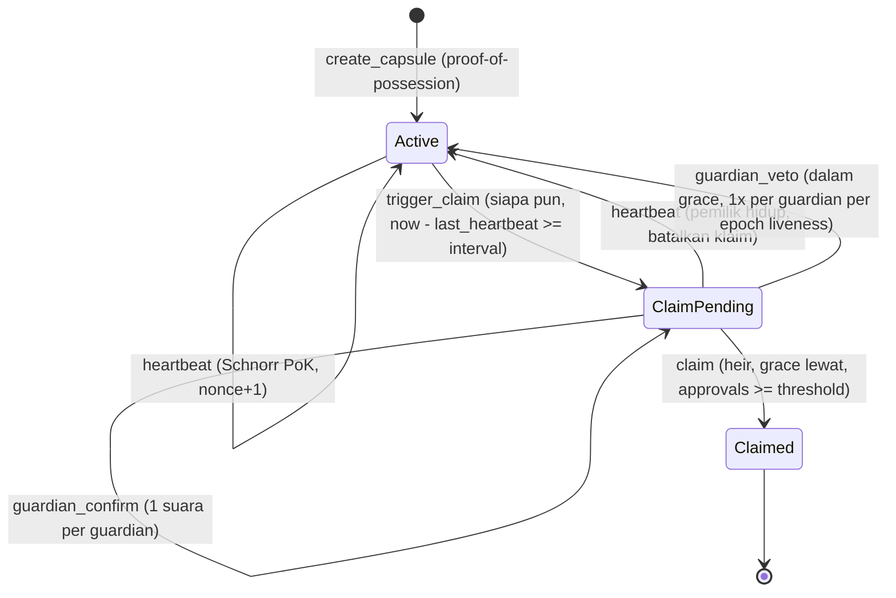

# SIKRIT — Security & Code Review (`programs/sikrit`)

> **Scope:** `programs/sikrit/src/lib.rs` versi awal (draft v0.1), konfigurasi build (`Anchor.toml`, `Cargo.toml`), desain kriptografi Schnorr proof-of-liveness, dan (sejak 30 Sep malam) protokol custody share di SDK client (`sdk/hpke.ts`, `sdk/shamir.ts`, `sdk/kit.ts`) — lihat §5.
> **Tanggal:** 30 September 2026 · **Metode:** review manual (kriptografi + keamanan smart contract), kompilasi SBF nyata, 10 unit test Rust, 35 test integrasi TypeScript di LiteSVM dengan time-travel, dan benchmark compute unit.
> **Hasil:** 15 temuan — 3 Critical, 4 High, 3 Medium, 4 Low, 1 Info (desain). Empat belas sudah diperbaiki di kode; SIK-11 dimitigasi di client (urutan release tetap janji guardian, bukan paksaan kriptografis).

---

## 1. Ringkasan Temuan

| ID | Severity | Temuan | Status |
|---|---|---|---|
| SIK-01 | 🔴 Critical | Replay bukti heartbeat: challenge Fiat–Shamir tanpa freshness/konteks | ✅ Fixed |
| SIK-02 | 🔴 Critical | Double-voting guardian: persetujuan dihitung tanpa identitas guardian | ✅ Fixed |
| SIK-03 | 🔴 Critical (blocker) | Verifikasi Schnorr tidak bisa berjalan on-chain (compile error, stack overflow SBF, > batas 1,4 jt CU) | ✅ Fixed |
| SIK-04 | 🟠 High | Klaim privasi runtuh: PDA diturunkan dari wallet pemilik & `owner` disimpan plaintext | ✅ Fixed |
| SIK-05 | 🟠 High | Pemilik yang masih hidup tidak bisa membatalkan false-trigger | ✅ Fixed |
| SIK-06 | 🟠 High | Veto tanpa batas (kapan saja, berulang) → DoS permanen terhadap ahli waris | ✅ Fixed |
| SIK-07 | 🟡 Medium | Commitment tidak divalidasi (titik small-order) & tanpa proof-of-possession | ✅ Fixed |
| SIK-08 | 🟡 Medium | Validasi guardian: duplikat, ahli waris sebagai guardian, pubkey default | ✅ Fixed |
| SIK-09 | 🔵 Low | Kalkulasi `space` manual (rawan salah saat struct berubah) | ✅ Fixed |
| SIK-10 | 🔵 Low | Konfigurasi build/test rusak (workspace, `idl-build`, script test rekursif, program ID placeholder) | ✅ Fixed |
| SIK-11 | ⚪ Info (desain) | `claim` hanya flag status — pelepasan rahasia belum dipaksakan secara kriptografis | 🟡 Mitigated (client, §5) |
| SIK-12 | 🟠 High (desain) | Kunci enkripsi ahli waris/guardian tanpa autentikasi → share bisa disegel/di-release ke kunci penyerang | ✅ Fixed (§5) |
| SIK-13 | 🟡 Medium | Shamir `combine` diam-diam menghasilkan rahasia salah untuk share palsu/kurang | ✅ Fixed (§5) |
| SIK-14 | 🔵 Low | Seed phrase di-split langsung (secret tidak uniform, panjang share membocorkan panjang rahasia) | ✅ Fixed (§5) |
| SIK-15 | 🔵 Low | Derivasi kunci dari tanda tangan wallet mengasumsikan tanda tangan deterministik tanpa dicek | ✅ Fixed (§5) |

Nomor baris di bawah merujuk ke **draft awal** `lib.rs`.

---

## 2. Detail Temuan

### SIK-01 🔴 Replay bukti heartbeat (CWE-294: Authentication Bypass by Capture-replay)

**Lokasi:** `lib.rs:86-91` — `e = SHA512(R ‖ Commitment)`
**Masalah:** challenge hanya bergantung pada `R` dan `P`. Setiap `(R, s)` yang pernah dikirim tercatat publik di transaksi, dan tetap valid selamanya. Siapa pun (misalnya pihak yang ingin menggagalkan pewarisan) bisa me-replay bukti lama tiap interval agar pemilik yang sudah wafat tampak "hidup" terus → ahli waris **tidak pernah** bisa klaim. Tidak ada juga domain separation: bukti yang sama valid untuk kapsul lain dengan `P` sama atau deployment program lain.
**Perbaikan:** transkrip diikat ke konteks dan counter monoton:

```
e = SHA-512(domain ‖ program_id ‖ capsule ‖ P ‖ R ‖ context) mod ℓ
domain  = "SIKRIT:liveness:v1"            context = heartbeat_nonce (u64 LE)
```

`heartbeat_nonce` naik setiap heartbeat sukses → setiap bukti hanya berlaku sekali.
**Test:** `rejects a replayed proof, so nobody can keep a dead owner 'alive'`, `rejects proofs bound to a stale or future nonce`, `proof_is_bound_to_nonce_capsule_domain_and_program` (Rust).

### SIK-02 🔴 Double-voting guardian (CWE-837: Improper Enforcement of a Single, Unique Action)

**Lokasi:** `lib.rs:140` — `guardian_approvals.saturating_add(1)`
**Masalah:** tidak dicatat guardian mana yang sudah menyetujui. Satu guardian (atau satu kunci guardian yang bocor) cukup memanggil `guardian_confirm` sebanyak `threshold` kali → skema N-of-M runtuh menjadi 1-of-M. Kolusi satu guardian + ahli waris = pelepasan dini.
**Perbaikan:** bitmap `approvals: u8` (bit ke-i = `guardians[i]`), suara ganda ditolak dengan `GuardianAlreadyApproved`.
**Test:** `counts each guardian once, so one guardian cannot satisfy a 2-of-3 threshold alone`.

### SIK-03 🔴 Verifikasi Schnorr tidak bisa berjalan on-chain (blocker)

**Lokasi:** `lib.rs:2,94-96`, `Cargo.toml` (`curve25519-dalek` dengan `default-features = false`)
**Masalah (terverifikasi dengan compiler & runtime, bukan asumsi):**
1. **Tidak compile:** `error[E0432]: unresolved import curve25519_dalek::constants::ED25519_BASEPOINT_TABLE` — konstanta itu butuh feature `precomputed-tables` (dimatikan oleh `default-features = false`), dan di dalek 4.x tipenya `&'static`, jadi `&ED25519_BASEPOINT_TABLE * &s` pun tidak valid.
2. **Melampaui batas stack SBF:** platform-tools melaporkan `Stack offset of 10984 exceeded max offset of 4096` pada tabel lookup dalek.
3. **Benchmark varian software-murni** (kode yang sama, backend kurva diganti curve25519-dalek di SBF, budget maksimum 1,4 jt CU):

| Instruksi | Syscall (produksi) | curve25519-dalek murni |
|---|---|---|
| `create_capsule` | 54.450 CU | ❌ `exceeded CUs meter` setelah 1.399.850 CU |
| `heartbeat` | 38.426 CU | ❌ `Access violation in stack frame 7` setelah 322.056 CU |

**Perbaikan:** operasi grup memakai syscall native Solana `sol_curve_validate_point`, `sol_curve_group_op`, `sol_curve_multiscalar_mul` (aktif di devnet sejak slot 240.192.004 dan mainnet sejak slot 275.184.000). Verifikasi `s·G − e·P == R` hanya **satu** panggilan multiscalar-mul. curve25519-dalek tetap dipakai untuk aritmetika skalar (reduksi `mod ℓ`, cek kanonik) dan sebagai backend host untuk unit test. Fungsi dalek yang melanggar batas stack **tidak ada** di binary final (0 simbol `NafLookupTable` di `sikrit.so`, diverifikasi dengan `llvm-objdump`); pesan `Stack offset exceeded` yang masih muncul saat build berasal dari kode dalek yang dieliminasi LTO.
**Test:** seluruh suite TS menjalankan verifier via syscall di binary SBF asli.

### SIK-04 🟠 Klaim privasi runtuh (CWE-359: Exposure of Private Personal Information)

**Lokasi:** `lib.rs:208` (`seeds = [b"capsule", owner]`), `lib.rs:37,270` (field `owner`), `lib.rs:299` (event `CapsuleCreated.owner`), `lib.rs:227` (`caller: Signer`)
**Masalah:** diferensiator utama SIKRIT ("heartbeat tidak membocorkan identitas") tidak terpenuhi. Siapa pun bisa menurunkan alamat kapsul dari pubkey wallet mana pun, lalu membaca `last_heartbeat` — persis ancaman "stalker" di threat model spec. Juri keamanan akan melihat ini dalam hitungan detik.
**Perbaikan:**
- PDA = `["capsule", P]` dengan `P` kunci publik liveness khusus (bukan kunci wallet); field `owner` dihapus; event tidak memuat wallet.
- `heartbeat` & `trigger_claim` **tanpa signer**: bukti Schnorr adalah satu-satunya otorisasi, jadi transaksi bisa di-relay fee payer mana pun.
- `create_capsule` dibayar `payer` generik yang tidak disimpan.
- SDK: `deriveLivenessSecret()` menurunkan `x` dari tanda tangan wallet atas pesan tetap → pemilik bisa memulihkan `x` dan menemukan kapsulnya tanpa menyimpan apa pun.

**Test:** `creates a capsule addressed only by its liveness commitment (no wallet identity on-chain)` memeriksa byte akun & event tidak memuat wallet pembayar; `accepts a proof relayed by an unrelated fee payer` memeriksa instruksi hanya berisi akun kapsul (tanpa signer).

### SIK-05 🟠 False-trigger tidak bisa dibatalkan pemilik (CWE-841: Improper Enforcement of Behavioral Workflow)

**Lokasi:** `lib.rs:70` — heartbeat mensyaratkan `status == Active`
**Masalah:** `trigger_claim` permissionless. Begitu pemilik telat satu interval (sakit, di pesawat, lupa), siapa pun men-trigger, dan pemilik **tidak bisa lagi** membuktikan liveness. Untuk kapsul tanpa guardian (threshold 0), ahli waris pasti bisa klaim walau pemilik masih hidup. Grace period di spec ("perlindungan false-trigger") tidak berfungsi untuk pemilik.
**Perbaikan:** heartbeat valid diterima saat `Active` **atau** `ClaimPending` (sampai ahli waris benar-benar klaim); status kembali `Active`, approval direset, event memuat `claim_cancelled = true`.
**Test:** `a heartbeat cancels a pending claim — even after the grace period, until the heir claims`.

### SIK-06 🟠 Veto tanpa batas → DoS permanen (CWE-400 / desain)

**Lokasi:** `lib.rs:152-169`
**Masalah:** (a) veto boleh kapan saja selama `ClaimPending`, termasuk **setelah** grace period (spec: "dalam grace period"), sehingga guardian bisa front-run klaim ahli waris; (b) satu guardian bisa memveto setiap siklus selamanya; (c) setelah veto, `last_heartbeat` tetap lama sehingga `trigger_claim` bisa langsung dipanggil lagi — veto tidak memberi pemilik waktu sama sekali.
**Perbaikan:** veto hanya saat `now − claim_triggered_at < grace_period`; veto memberi pemilik satu interval penuh (`last_heartbeat = now`); tiap guardian hanya punya **satu** veto (bitmap `vetoes`) sampai pemilik heartbeat lagi. Penundaan maksimum oleh guardian jahat = `jumlah_guardian × (interval + grace)`, terbatas.
**Test:** `cancels a false trigger and gives the owner a full new interval`, `gives each guardian one veto until the owner proves liveness again (bounded griefing)`, `restores veto rights once the owner proves liveness`, `closes the veto window when the grace period ends`.

### SIK-07 🟡 Commitment tidak divalidasi & tanpa proof-of-possession (CWE-20, CWE-345)

**Lokasi:** `lib.rs:39` (commitment diterima apa adanya)
**Masalah:** Ed25519 punya cofactor 8. Dengan `P` berorde kecil (identitas, byte all-zero = titik orde 4, dll.), bukti bisa dipalsukan tanpa mengetahui `x` (peluang ≥ 1/8 per percobaan) → siapa pun bisa menjaga kapsul "hidup". Titik mixed-torsion `x·G + T` membuat bukti pemilik sendiri gagal 7/8 kali. Tanpa proof-of-possession, orang bisa mendaftarkan `P` milik orang lain atau menyerobot (front-run) PDA dengan konfigurasi berbeda.
**Perbaikan:** `P` wajib encoding kanonik, bukan identitas, dan di subgrup prima (`ℓ·P = O`, dihitung sebagai `(ℓ−1)·P + P` karena syscall hanya menerima skalar kanonik). `create_capsule` mensyaratkan bukti Schnorr dengan domain `SIKRIT:register:v1` yang mengikat **seluruh** `Borsh(CapsuleConfig)`, sehingga bukti tidak bisa dipindah ke heir/guardian lain.
**Test:** `rejects identity, small-order, mixed-torsion and non-canonical commitments`, `rejects a proof-of-possession made without the secret`, `rejects a front-runner replaying the owner's proof-of-possession with a different heir`, `commitment_must_be_canonical_prime_order_point` (Rust, 8 titik torsi).

### SIK-08 🟡 Validasi himpunan guardian (CWE-20)

**Lokasi:** `lib.rs:28-32`
**Masalah:** guardian duplikat (satu orang = beberapa suara), ahli waris sebagai guardian (menyetujui klaimnya sendiri), dan `Pubkey::default()` (System Program, tak bisa tanda tangan) diterima.
**Perbaikan:** `CapsuleConfig::validate()` menolak semuanya dengan error spesifik (`DuplicateGuardian`, `HeirCannotBeGuardian`, `InvalidGuardian`, `InvalidHeir`).
**Test:** `rejects invalid configurations` (9 kasus), `config_validation` (Rust).

### SIK-09 🔵 Kalkulasi `space` manual

**Lokasi:** `lib.rs:207`
**Masalah:** benar untuk struct lama (628 byte), tetapi mudah salah saat field berubah (dan memang berubah di perbaikan ini).
**Perbaikan:** `#[derive(InitSpace)]` + `#[max_len(...)]`, `space = 8 + Capsule::INIT_SPACE`.

### SIK-10 🔵 Konfigurasi build/test rusak

- Tidak ada workspace `Cargo.toml` di root → `anchor build` gagal; `[profile.release]` di crate member diabaikan cargo.
- Feature `idl-build` tidak ada → Anchor 0.30 menolak build IDL.
- `Anchor.toml`: `[scripts] test = "anchor test"` memanggil dirinya sendiri (rekursi tanpa akhir); `[toolchain.anchor]` bukan skema valid; `cluster = "devnet"` membuat `anchor test` deploy memakai SOL wallet.
- `declare_id!` memakai ID contoh bawaan Anchor (`Fg6Pa…`) yang keypair-nya tidak kita miliki → tidak bisa deploy.

**Perbaikan:** workspace + lockfile ter-pin (resolusi dependency dari CI resmi Anchor v0.30.2), `idl-build`, `anchor keys sync` (program ID baru `FJKqfFBf6Sw87eAfpgDbibiWUKhpmdVjFxexc9BTc45F`), test script `npm test`, cluster default `localnet`.

### SIK-11 ⚪ Pelepasan rahasia belum dipaksakan kriptografis (desain, M2)

`claim` hanya mengubah status menjadi `Claimed`. Keamanan inti ("ahli waris **tidak boleh** bisa membuka selama pemilik hidup") sepenuhnya bergantung pada distribusi share off-chain. Jika ahli waris memegang ≥ k share sejak awal (mis. Share B dan Share C sama-sama dienkripsi ke pubkey ahli waris seperti tersirat di spec §3.1), ahli waris bisa merekonstruksi rahasia **kapan saja** dan dead man's switch tidak berarti.

**Status (30 Sep):** dimitigasi di client lewat protokol custody §5 — ahli waris hanya memegang 1 share (< k), guardian me-release share mereka hanya setelah `Claimed` dan hanya ke kunci inbox yang disertifikasi wallet `heir` on-chain. Yang tetap berupa asumsi kepercayaan: kuorum guardian tidak berkolusi dengan ahli waris sebelum pemilik wafat.

**Rekomendasi awal (M2):** ahli waris hanya memegang < k share. Share sisanya dienkripsi ke masing-masing guardian, dan guardian menyerahkannya (re-encrypt ke ahli waris) **hanya setelah** status on-chain `Claimed`. Dengan begitu kepercayaan yang tersisa eksplisit: "≥ threshold guardian tidak berkolusi dengan ahli waris sebelum pemilik wafat". `share_hashes` on-chain dipakai ahli waris untuk memverifikasi integritas share yang diterima (sudah didemonstrasikan di test end-to-end). Alternatif lanjutan: jaringan threshold (mis. Lit Protocol) yang membaca status program.

---

## 3. Spesifikasi Protokol Setelah Perbaikan

### Transkrip Fiat–Shamir

```
e = SHA-512(domain ‖ program_id ‖ capsule ‖ P ‖ R ‖ context) mod ℓ        (wide reduction, 64 byte)
Prover : k = hedged nonce (x, aux acak, transkrip), R = k·G, s = k + e·x mod ℓ
Verifier: s kanonik (< ℓ), R titik valid, dan  s·G − e·P == R  (dibandingkan byte-per-byte, encoding kanonik)

Registrasi : domain = "SIKRIT:register:v1", context = Borsh(CapsuleConfig)
Liveness   : domain = "SIKRIT:liveness:v1", context = heartbeat_nonce (u64 little-endian)
```

Kedua domain sama panjang (18 byte) dan berbeda isi, sehingga tidak ada ambiguitas antar-transkrip. Format ini dikunci lintas bahasa oleh known-answer vector yang sama di `tests/sikrit.ts` (prover TS) dan unit test Rust (verifier).

### State machine



### Biaya compute (LiteSVM, binary SBF asli)

| Instruksi | CU (maks teramati) |
|---|---|
| `create_capsule` (termasuk validasi ℓ·P dan proof-of-possession) | ~68.000–74.000 (bervariasi: pencarian bump PDA bergantung commitment) |
| `heartbeat` | 40.645 |
| `trigger_claim` | 6.935 |
| `guardian_confirm` | 7.054 |
| `guardian_veto` | 6.562 |
| `claim` | 7.323 |

Semua di bawah budget default 200.000 CU per instruksi → tidak perlu instruksi ComputeBudget.

---

## 4. Risiko Residual & Batasan (jujur untuk pitch & Q&A)

| # | Risiko | Catatan / Mitigasi |
|---|---|---|
| R1 | Waktu heartbeat tetap publik | `last_heartbeat` dan timestamp transaksi terlihat oleh siapa pun yang tahu alamat kapsul (termasuk ahli waris & guardian). Yang disembunyikan adalah **siapa** (tidak ada tautan ke wallet), bukan **kapan**. Roadmap v2: bukti keanggotaan anonim (ring signature / Groth16) agar heartbeat tidak menunjuk kapsul tertentu. |
| R2 | Tautan lewat fee payer | Jika wallet pemilik membayar `create_capsule`/`heartbeat`, transaksi itu menautkan wallet ke kapsul. Frontend harus memakai fee payer terpisah (burner/relayer). v2: relayer yang dibayar dari saldo kapsul. |
| R3 | Heir & guardian publik | Pubkey ahli waris dan guardian tersimpan plaintext. v2: simpan komitmen hash + salt, dibuka saat aksi. |
| R4 | Upgrade authority | Program Solana dapat di-upgrade oleh deployer. Untuk produksi: pindahkan upgrade authority ke multisig atau jadikan immutable setelah audit. |
| R5 | Penundaan oleh guardian jahat | Terbatas `jumlah_guardian × (interval + grace)`. Jika ingin lebih ketat: veto butuh threshold guardian. |
| R6 | Toolchain legacy | Anchor 0.30.x menghasilkan SBPF v0. Agave 4.3 sudah memuat feature gate SIMD-0500 (menonaktifkan deploy SBPF v0–v2) yang **belum aktif** di devnet/mainnet per 30 Sep 2026. Setelah hackathon, migrasi ke Anchor 1.x (SBPF v3). |
| R7 | Rent tidak bisa ditarik kembali | Tidak ada instruksi `close`; rent ~0,005 SOL per kapsul terkunci. Tambahkan `close` pasca-`Claimed` jika diperlukan. |
| R8 | Pemilik tidak sadar ada trigger | Pemilik perlu notifikasi off-chain (watcher event `ClaimTriggered`) agar sempat heartbeat selama grace period. |
| R9 | Phishing tanda tangan kunci liveness / inbox | `deriveLivenessSecret()` (SDK) menurunkan `x` dari tanda tangan wallet atas `KEYGEN_MESSAGE`. Situs phishing yang mendapat tanda tangan yang sama bisa memalsukan heartbeat (menahan pewarisan), walau tidak bisa membuka rahasia. Mitigasi: ikat origin/domain aplikasi ke pesan (gaya Sign-In With Solana) atau pakai `generateLivenessSecret()` acak yang disimpan terenkripsi. Hal yang sama berlaku untuk `INBOX_MESSAGE`: tanda tangan yang dicuri membuka share milik pemegang itu saja (< k). |
| R10 | Bukan post-quantum | X25519 (HPKE) dan Ed25519 tidak tahan komputer kuantum. Kit sengaja tidak ditaruh di storage publik permanen (hanya hash yang on-chain) sehingga tidak bisa di-*harvest now, decrypt later* secara massal. Roadmap: KEM hibrida X-Wing (ML-KEM-768 + X25519) begitu HPKE-nya terstandar; format kit sudah berversi. |
| R11 | Side channel JavaScript | JS (JIT + GC) tidak menjamin constant-time; aritmetika GF(2^8) library Shamir memakai tabel lookup. Operasi dilakukan sekali di device pengguna; penyerang lokal yang bisa mengukur cache di device itu di luar model ancaman. |
| R12 | Kompatibilitas wallet | Derivasi kunci butuh `signMessage` dengan tanda tangan Ed25519 deterministik atas byte mentah. Wallet MPC dengan tanda tangan acak ditolak saat setup (SIK-15); Ledger yang hanya menandatangani format *off-chain message* Solana perlu dukungan terpisah. |
| R13 | Ahli waris kehilangan wallet | Share ahli waris tidak bisa dibuka lagi. Jalan pemulihan: kuorum guardian yang cukup untuk k (mis. 3 guardian untuk k = 3) me-release ke kunci inbox baru, asalkan wallet `heir` on-chain masih bisa menandatangani sertifikat baru. |
| R14 | Advisory npm transitif | `npm audit --omit=dev`: `toml` (via `@anchor-lang/core`) dan `uuid` (via `@solana/web3.js`). Jalur kodenya (parsing TOML workspace Anchor, `uuid` v3/v5 dengan buffer) tidak dipakai SDK/frontend; dicek ulang saat audit akhir (F6). |
| R15 | Kolusi guardian tanpa ahli waris | Kit memakai Shamir k = kuorum + 1 atas n = 1 + jumlah guardian. Kalau jumlah guardian ≥ k (mis. 3 guardian, kuorum 2 → k = 3), **k guardian yang berkolusi bisa membuka rahasia tanpa ahli waris dan sebelum klaim on-chain**. Ini sifat bawaan skema threshold, dan sekaligus jalur pemulihan R13. Ahli waris sendirian atau kuorum guardian saja (< k) tidak bisa. Wizard menampilkan peringatan ini setiap kali jalur kolusi tersebut ada; pemilik yang tidak menginginkannya bisa memilih kuorum = semua guardian (k = jumlah guardian + 1, ahli waris selalu dibutuhkan, tapi R13 hilang). |

### Catatan kejujuran klaim (PITCH.md)

- ✅ Aman diklaim: *"Heartbeat SIKRIT adalah zero-knowledge proof of knowledge (Schnorr/Fiat–Shamir) dengan kunci liveness khusus; tidak ada wallet atau identitas pemilik di state, event, maupun instruksi heartbeat, dan siapa pun bisa me-relay-nya."*
- ⚠️ Perlu dikoreksi: PITCH §4 menyebut heartbeat "tanpa reveal siapa, **kapan**, di address mana", dan one-liner menyebut guardian & ahli waris "tidak pernah tahu kamu masih hidup". Waktu heartbeat tetap publik (R1), dan ahli waris/guardian yang mengetahui alamat kapsul bisa melihat `last_heartbeat`. Formulasi yang aman: *"liveness tidak bisa ditautkan ke identitas/wallet pemilik"*.
- ℹ️ Schnorr NIZK ≈ tanda tangan Schnorr dengan kunci sekali-pakai-tujuan. Juri kriptografi akan menghargai bila ini dinyatakan terbuka: kekuatannya ada pada **unlinkability + anti-replay + domain separation**, bukan pada SNARK.

---

## 5. Protokol Custody Share di Client (SDK, M2)

Spesifikasi lengkap: `docs/TECHNICAL-SPEC.md` §3. Ringkasan konstruksi:

```
dek ← acak 32 B;  payload = XChaCha20-Poly1305(dek, nonce, aad = "SIKRIT:payload:v1" ‖ P ‖ k ‖ n)(rahasia)
share_i  = Shamir k-of-n (dek)                     sealed_i = HPKE(X25519, HKDF-SHA256, ChaCha20-Poly1305)
hash_i   = SHA-256("SIKRIT:share-hash:v1" ‖ P ‖ share_i)  → share_hashes on-chain (ikut ditandatangani PoP)
share_0 → ahli waris, share_{1+g} → guardian g, k − 1 = kuorum guardian
```

### SIK-12 🟠 Kunci enkripsi tanpa autentikasi (CWE-322: Key Exchange without Entity Authentication)

**Masalah:** spec awal hanya menyebut "enkripsi share ke pubkey heir" tanpa menjelaskan dari mana pemilik mendapatkan kunci enkripsi ahli waris/guardian. Kunci enkripsi (X25519) bukan kunci wallet, jadi harus dikirim lewat kanal off-chain. Penyerang yang menukar kunci di kanal itu (atau di file kit) menerima share: saat setup (pemilik menyegel ke kunci penyerang) maupun saat release (guardian me-re-seal ke "ahli waris" palsu). Dengan mengganti kunci semua pemegang, penyerang mendapat ≥ k share.
**Perbaikan:** *inbox certificate* — tanda tangan wallet pemegang atas `"SIKRIT inbox certificate v1: <hex inbox>"`. `sealCapsuleKit` menolak sertifikat tidak valid serta wallet/inbox ganda; `verifyKit` mencocokkan wallet pemegang dengan `heir`/`guardians` on-chain secara berurutan; `releaseShare` hanya menyegel ke inbox yang disertifikasi wallet `heir` on-chain, hanya jika kapsul `Claimed`, dan hanya untuk share guardian.
**Test:** `carries inbox keys in wallet-signed invites; a swapped key or wallet is rejected`, `guardians release only after the claim, only to the on-chain heir, and only their own share`, `verifies a kit against the capsule's commitment, share hashes, heir and guardians on-chain`, `refuses unsafe parameters`.

### SIK-13 🟡 Rekonstruksi Shamir tanpa integritas (CWE-354)

**Masalah:** `combine` dari library Shamir tidak bisa membedakan share benar dan salah (disebutkan di README library). Guardian jahat yang mengirim share palsu, atau ahli waris yang menggabungkan share kurang dari k, mendapat rahasia yang salah tanpa error — dan tidak tahu share mana yang buruk.
**Perbaikan:** setiap share diautentikasi terhadap `share_hashes` on-chain sebelum digabung (share asing ditolak dengan pesan eksplisit), jumlah share distinct dicek terhadap k, dan tag AEAD payload mengautentikasi DEK hasil rekonstruksi (threshold yang dimanipulasi → gagal tertutup).
**Test:** `rejects a forged or foreign share by name instead of reconstructing garbage`, `authenticates the payload: a tampered threshold or ciphertext fails closed`.

### SIK-14 🔵 Rahasia tidak uniform di-split langsung

**Masalah:** test E2E dan spec §3.1 lama men-split seed phrase (UTF-8) langsung. Library merekomendasikan rahasia uniform ("encrypt the value and split the encryption key"); panjang share juga membocorkan panjang rahasia (12 vs 24 kata).
**Perbaikan:** hybrid — yang di-split selalu DEK 32 byte acak (share 33 byte tetap), rahasia dienkripsi XChaCha20-Poly1305 dengan AAD yang mengikat `P`, k, n.

### SIK-15 🔵 Asumsi tanda tangan deterministik

**Masalah:** `deriveLivenessSecret` dan kunci inbox diturunkan dari tanda tangan wallet. Wallet dengan tanda tangan acak (sebagian wallet MPC/threshold) menghasilkan kunci berbeda di setiap sesi: pemilik tidak bisa heartbeat lagi (kapsul terbuka saat ia masih hidup), ahli waris tidak bisa membuka share-nya.
**Perbaikan:** `deriveLivenessSecretFromWallet` dan `createInbox` menandatangani dua kali, memverifikasi tanda tangan terhadap wallet, dan menolak jika berbeda.
**Test:** `derives the owner's liveness key only from a deterministic signature by the owner's wallet`, `onboards only wallets that sign deterministically, and only for the wallet that signed`.

### Known-answer vectors

| Komponen | Referensi eksternal |
|---|---|
| HPKE (`sdk/hpke.ts`) | RFC 9180 Appendix A.2.1: key pair, key schedule, 6 enkripsi (seq 0–256), 3 exported value |
| GF(2^8) Shamir (`sdk/shamir.ts`) | Referensi tanpa tabel, dijangkar contoh FIPS-197 §4.2 (`{57}·{83} = {c1}`); vektor 3-of-5 ter-pin |
| Inbox key & share hash (`sdk/kit.ts`) | Dihitung ulang secara independen dengan Python `hashlib`/`hmac` + pyca `cryptography` |

---

## 6. Cara Mereproduksi

```bash
npm run build                # anchor build: SBF + IDL (Solana 1.18.17, Anchor CLI 0.30.2)
npm run test:rust            # 10 unit test verifier Schnorr + validasi config
npm test                     # 35 test lifecycle di LiteSVM + 24 test SDK (Node 24 LTS)
npm run typecheck
```

Detail toolchain ada di `README.md`.
